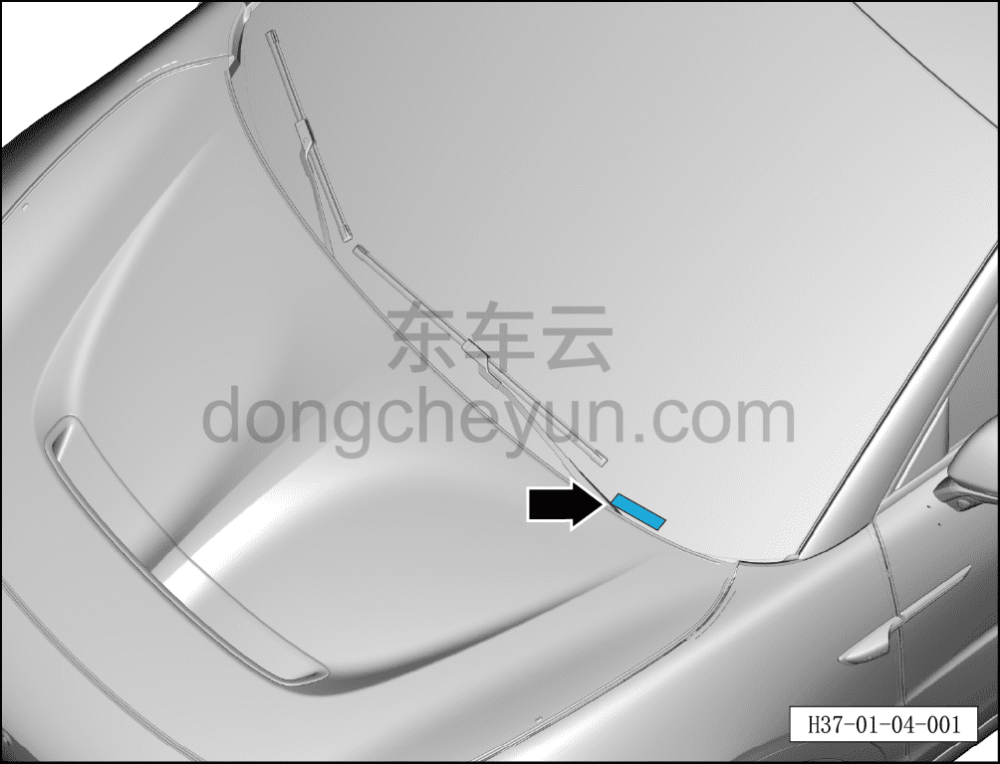
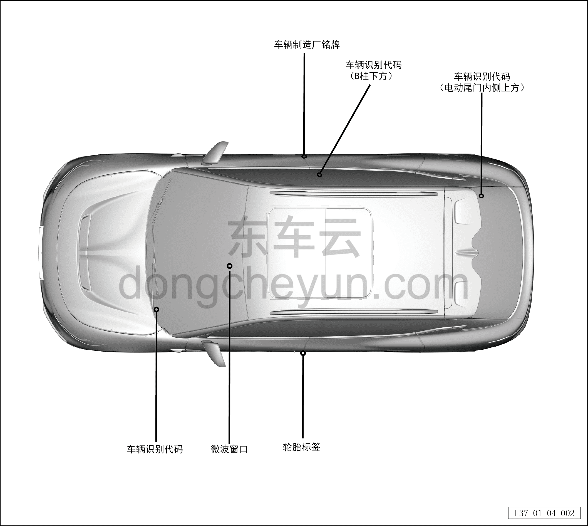

# Идентификационный номер автомобиля (VIN)

> Обзор › Идентификация (маркировка)  
> Оригинал: `车辆识别代码（VIN）` · [dongcheyun 56746](https://dongcheyun.com/p/56746), страница `25fef2077198457192dc3ecfdc21db50` · [оглавление](../README.md)

Идентификационный номер автомобиля (нижняя кромка лобового стекла): в нижней части лобового стекла с левой стороны — идентификационный номер автомобиля.

