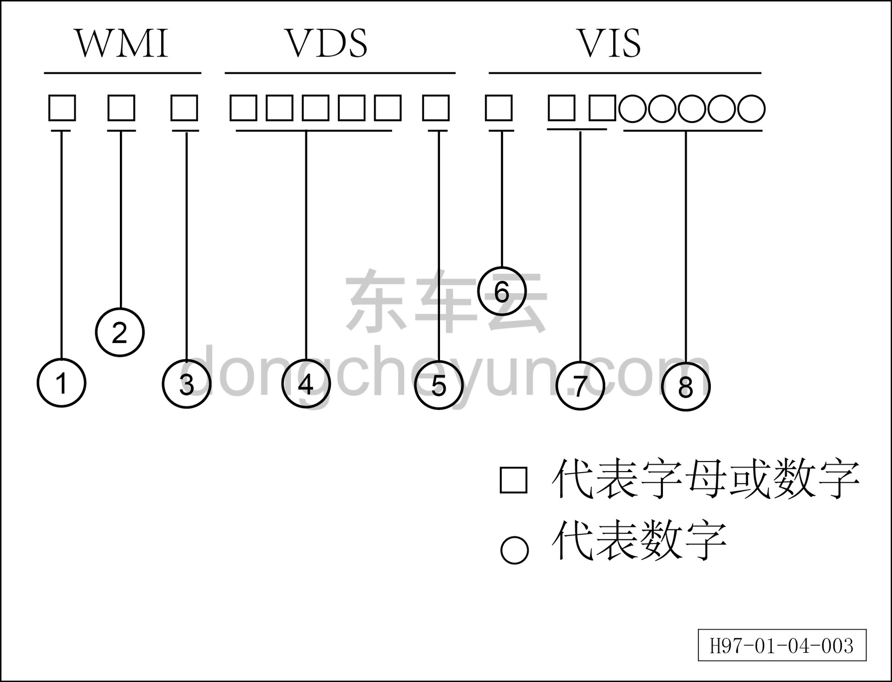

# Правила формирования идентификационного номера автомобиля

> Обзор › Идентификация (маркировка)  
> Оригинал: `车辆识别代码的编写规则` · [dongcheyun 56746](https://dongcheyun.com/p/56746), страница `e652394478154d56bcee4dfacc56571f` · [оглавление](../README.md)

Идентификационный номер автомобиля (способ кодирования)

– Идентификационный номер автомобиля содержит следующую информацию:

① Географический регион

② Страна

③ Изготовитель

④ Код характеристик автомобиля

⑤ Контрольный разряд

⑥ Год выпуска

⑦ Завод-изготовитель (сборочный завод)

⑧ Производственный серийный номер
