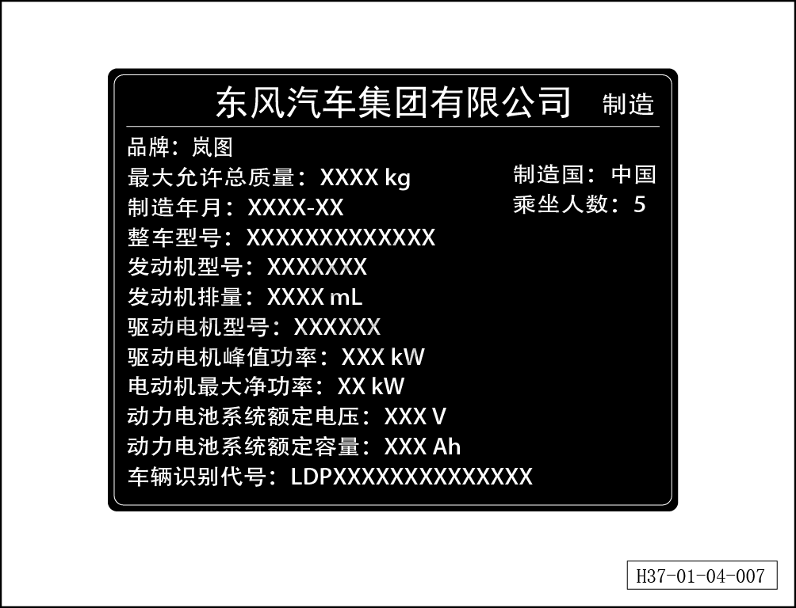

# Табличка с идентификационными данными автомобиля

> Обзор › Идентификация (маркировка)  
> Оригинал: `车辆铭牌标签` · [dongcheyun 56746](https://dongcheyun.com/p/56746), страница `6a7a0fbff9834e9ba02210bc3bbbf787` · [оглавление](../README.md)

Табличка с идентификационными данными автомобиля наклеена на дверном проёме правой передней двери.
