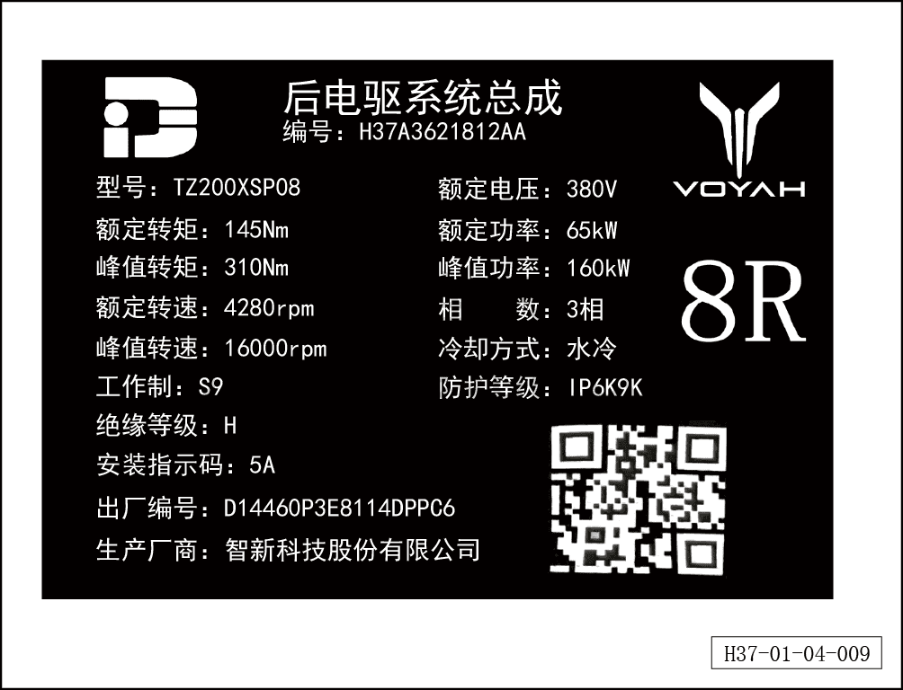

# Табличка заднего тягового электродвигателя

> Обзор › Идентификация (маркировка)  
> Оригинал: `后驱动电机铭牌` · [dongcheyun 56746](https://dongcheyun.com/p/56746), страница `379d28e53fe84f6a93b7a750c9d9228d` · [оглавление](../README.md)

Табличка заднего тягового электродвигателя расположена на передней стороне электродвигателя.
