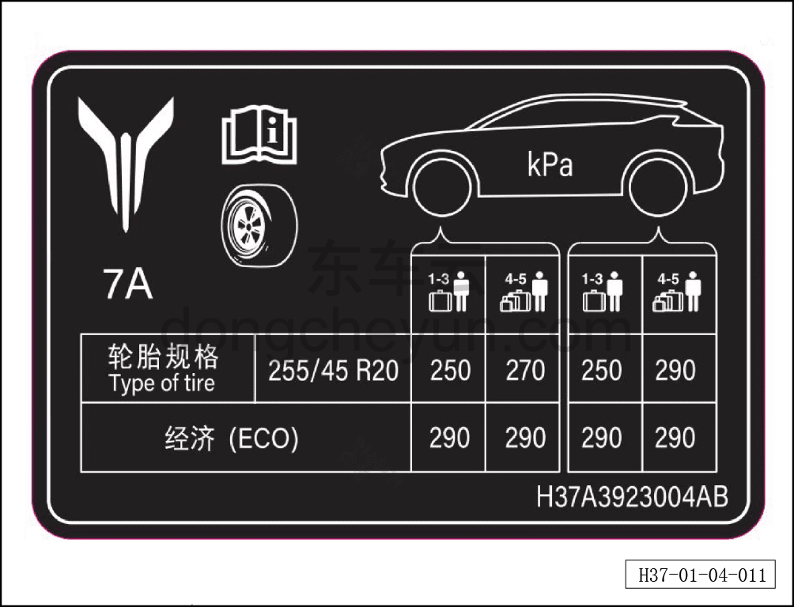

# Табличка с данными о накачке шин автомобиля

> Обзор › Идентификация (маркировка)  
> Оригинал: `车辆轮胎充气标签` · [dongcheyun 56746](https://dongcheyun.com/p/56746), страница `4f93076a246945549cfe12e2339e8cf6` · [оглавление](../README.md)

Табличка с данными о накачке шин автомобиля расположена в нижней части стойки B со стороны водителя.

Под левой стойкой B: стрелка к табличке с информацией о накачке шин.
