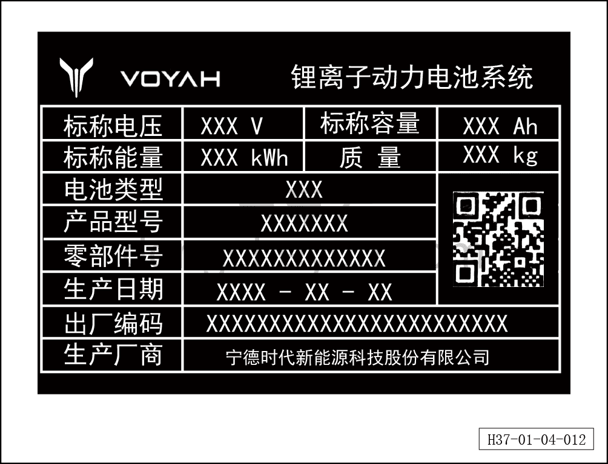

# Табличка тяговой батареи

> Обзор › Идентификация (маркировка)  
> Оригинал: `动力电池铭牌` · [dongcheyun 56746](https://dongcheyun.com/p/56746), страница `8cb889415d7e49dc956b82df0d33d760` · [оглавление](../README.md)

Табличка тяговой батареи расположена в передней части тяговой батареи (со стороны передней части автомобиля).
