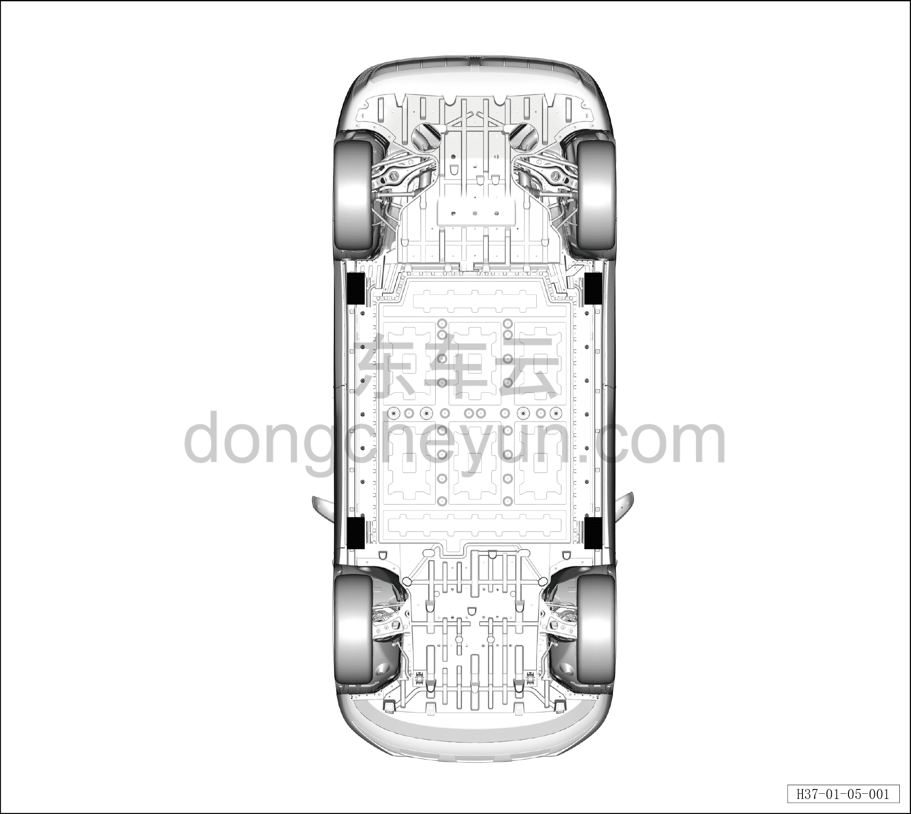

# Подъём автомобиля

> Обзор › Подъём и опора автомобиля  
> Оригинал: `车辆举升` · [dongcheyun 56746](https://dongcheyun.com/p/56746), страница `3c5e8c6c598449e0bf782e1a46577a6a` · [оглавление](../README.md)

**Предупреждение!**

**- Использование точек подъёма, указанных на рисунке ниже, крайне важно для безопасности подъёма. В противном случае это может привести к повреждению автомобиля или травмам людей.**

**- При подъёме автомобиля двухстоечным подъёмником в точках подъёма обязательно используйте горизонтальные опорные подкладки.**

