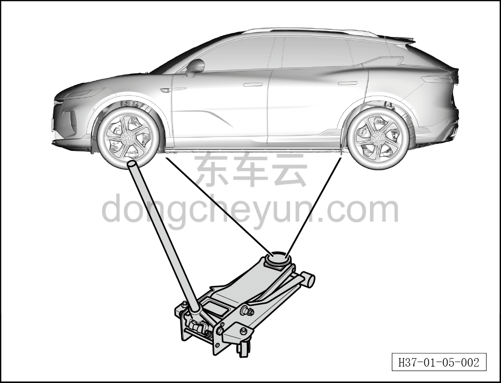
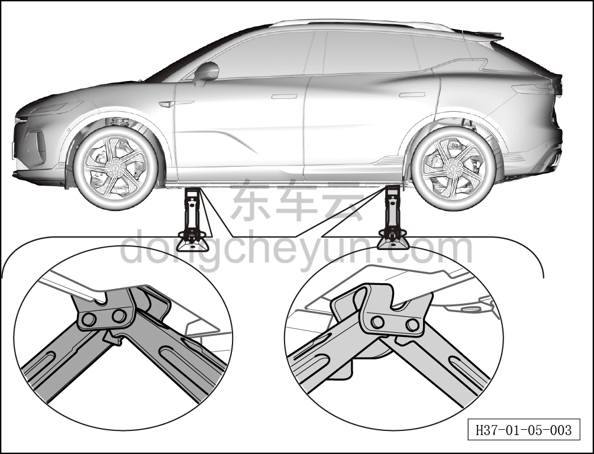

# Опора автомобиля

> Обзор › Подъём и опора автомобиля  
> Оригинал: `车辆支撑` · [dongcheyun 56746](https://dongcheyun.com/p/56746), страница `4d9fca0796004cc4b39e9730a37e7ab5` · [оглавление](../README.md)

**Предупреждение!**

**- Обязательно устанавливайте автомобиль на твёрдой горизонтальной поверхности. Если необходимо поднять автомобиль домкратом на мягком грунте, под домкрат необходимо подложить распределительную подкладку и обязательно установить противооткатные упоры на колесо, расположенное по диагонали от точки подъёма. Несоблюдение этих требований может привести к травмам людей. При использовании домкрата для ремонта автомобиля крайне важно полностью изучить следующие указания. Необходимо определить правильную точку опоры — обычно точка опоры выбирается в открытой зоне между передним и задним колёсами. При использовании домкрата используйте прокладку для защиты лакокрасочного покрытия от повреждений.**

