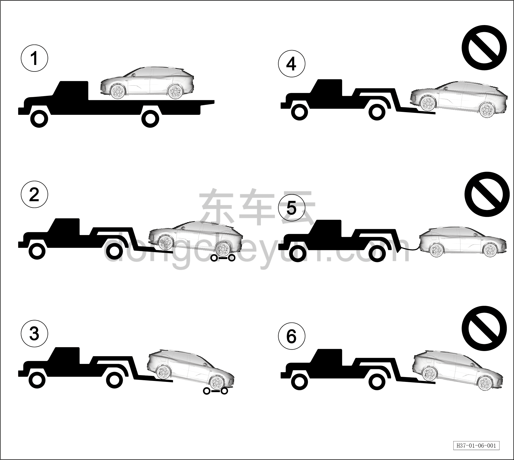

# Буксировка автомобиля тягачом (эвакуатором)

> Обзор › Буксировка автомобиля  
> Оригинал: `拖车牵引` · [dongcheyun 56746](https://dongcheyun.com/p/56746), страница `141c28f421ab40fe8d69a8092b887c5c` · [оглавление](../README.md)

1. Если автомобиль требует буксировки, она должна выполняться авторизованным сервисным центром Voyah или профессиональной компанией по буксировке.

2. Рекомендуется перевозить автомобиль на платформенном автовозе. При отсутствии такой возможности допускается использовать эвакуатор с частичным подъёмом колёс, в зависимости от ситуации.

3. Необходимо использовать способ буксировки с отрывом всех четырёх колёс от земли ①②③; запрещается использовать способы буксировки ④⑤⑥, показанные на рисунке.

4. Перед буксировкой автомобиль должен быть обесточен, включена аварийная сигнализация, двери закрыты и заперты на механический замок.

5. Во время буксировки запрещается находиться людям внутри автомобиля.

**Внимание:**

**● Если невозможно использовать платформенный автовоз для буксировки автомобиля, можно использовать буксировочное кольцо для экстренной буксировки автомобиля в безопасную зону в ожидании помощи.**

**● Буксировку с места происшествия можно проводить только при условии отсутствия угроз безопасности. Если корпус батареи автомобиля деформирован, из него течёт жидкость или идёт дым, необходимо сначала устранить угрозу безопасности.**
