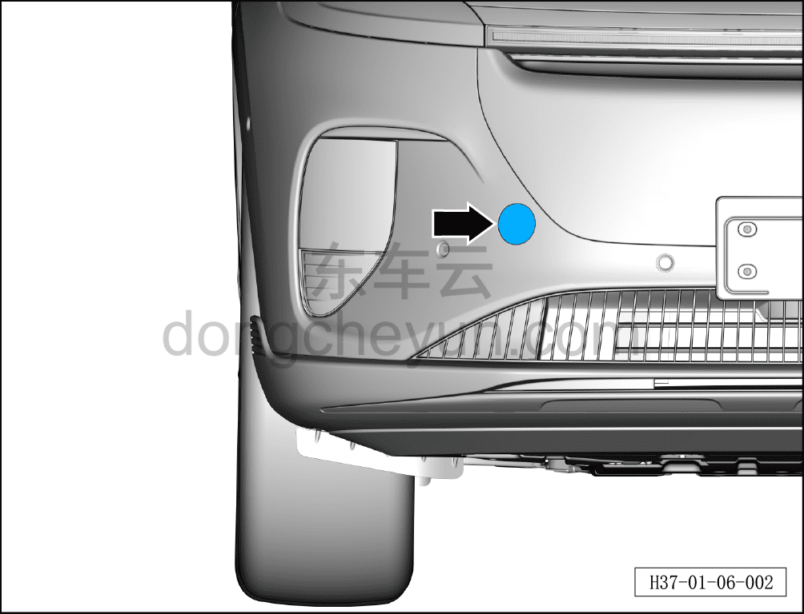
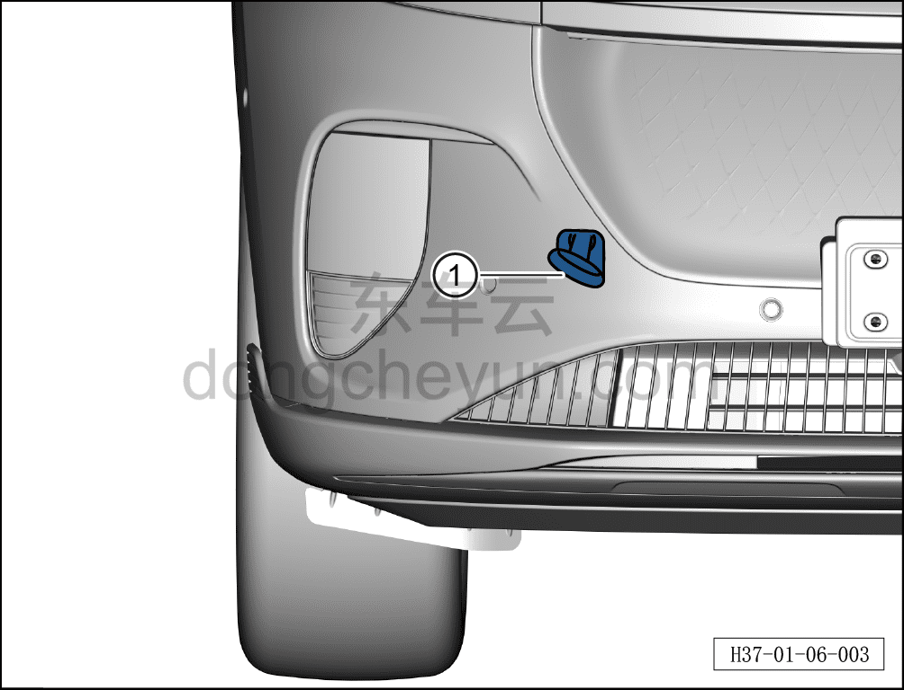

# Экстренная буксировка

> Обзор › Буксировка автомобиля  
> Оригинал: `紧急牵引` · [dongcheyun 56746](https://dongcheyun.com/p/56746), страница `798beb2a0ede4ea894c437e72aa8afda` · [оглавление](../README.md)

Если в экстренной ситуации невозможно найти платформенный автовоз, можно временно буксировать автомобиль, закрепив буксировочный трос или цепь в кольце экстренной буксировки, однако этот способ подходит только для буксировки на низкой скорости и короткое расстояние по твёрдому ровному дорожному покрытию. (На данной модели буксировочное кольцо предусмотрено только в передней части.)

Место и способ установки переднего буксировочного кольца:

**Примечание:**

**- При необходимости буксировки сначала установите буксировочное кольцо.**

**- Буксировочное кольцо входит в комплект инструментов автомобиля.**

**- Если стояночный тормоз не удаётся снять обычным способом, можно использовать способ ручного снятия стояночного тормоза, см. [6.6.6.11 Ручная разблокировка стояночного тормоза](../06-система-шасси/083-ручная-разблокировка-стояночного-тормоза.md)**

Передняя буксировка

a. Снимите декоративную крышку переднего буксировочного кольца.

b. Вкрутите буксировочное кольцо ①, закрепите буксировочный трос.
