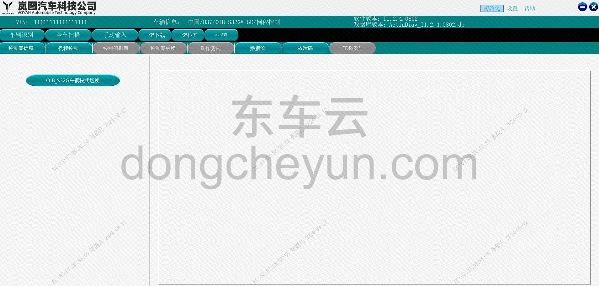
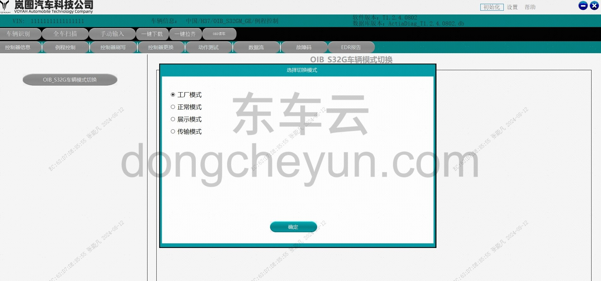

# Проверка комплектности электрооборудования

> Подготовка нового автомобиля › Технология подготовки › Порядок выполнения работ  
> Оригинал: `电气完备性检查` · [dongcheyun 56746](https://dongcheyun.com/p/56746), страница `786273a56b6f4d91bfb27fef28dc8931` · [оглавление](../README.md)

-Переключение режима автомобиля.

● Подключить диагностический сканер, войти в модуль управления «OIB-S32GM-GE», выбрать «Управление процедурами».

● Нажать «Переключение режима автомобиля OIB-S32G» и при необходимости выбрать для переключения любой из режимов: «Заводской режим», «Обычный режим», «Демонстрационный режим», «Режим транспортировки».

-Очистка кодов неисправностей автомобиля.

● Подключить диагностический сканер, нажать «Автоматическое определение», затем «Открыть автомобиль», очистить все коды неисправностей автомобиля.

-Проверка напряжения и ёмкости аккумуляторной батареи (с использованием прибора для проверки аккумуляторной батареи), записать напряжение и ёмкость аккумуляторной батареи.

| Результат измерения | Действие |
|---|---|
| Батарея исправна | Продолжить использование аккумуляторной батареи |
| Исправна — требуется зарядка | После полной зарядки аккумуляторной батареи продолжить её использование |
| После зарядки повторить проверку | После полной зарядки аккумуляторной батареи провести повторную проверку |
| Заменить батарею | Возможно, плохое соединение кабелей аккумуляторной батареи; после устранения неисправности повторно проверить аккумуляторную батарею |
| Батарея с повреждённой ячейкой — требуется замена | Необходимо немедленно заменить аккумуляторную батарею |

-Проверить надёжность соединения клемм аккумуляторной батареи (наконечник кабеля не должен поворачиваться рукой), проверить клеммы на наличие коррозии.

-Проверить внешний вид аккумуляторной батареи.

● Наличие утечки электролита.

● Наличие следов ударов или трещин на корпусе.

● Наличие деформации.

- Проверить остаточный заряд тяговой батареи (>20%).
