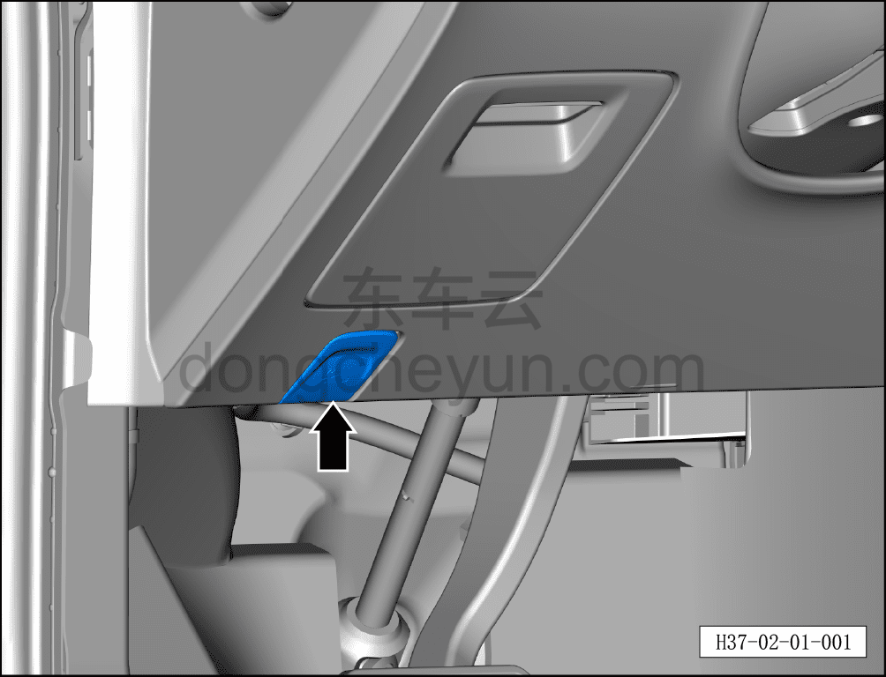

# Проверка капота

> Подготовка нового автомобиля › Технология подготовки › Порядок выполнения работ › Проверка переднего отсека  
> Оригинал: `前机舱罩检查` · [dongcheyun 56746](https://dongcheyun.com/p/56746), страница `a1a457e8834a49bfb7d9d810313a051d` · [оглавление](../README.md)

- Разблокировать капот (рычаг открывания находится в салоне со стороны водителя, под панелью приборов).

- Удалить защитную плёнку с коврика водителя и защитную плёнку с лакокрасочного покрытия капота.

- Потянуть рычаг открывания капота 1 раз, приподнять капот и проверить, находится ли он ещё в зацеплении (на предохранительном крюке).

- Потянуть рычаг открывания капота 2 раза, открыть капот.

- Проверить нормальную работу гидравлической стойки и шарниров (петель).

