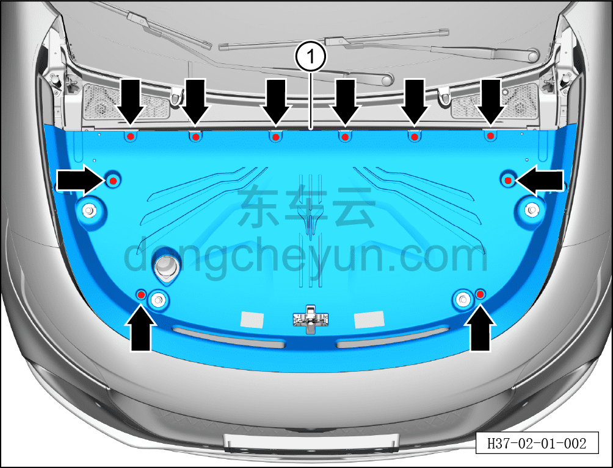

# Снятие декоративной панели переднего отсека

> Подготовка нового автомобиля › Технология подготовки › Порядок выполнения работ › Проверка переднего отсека  
> Оригинал: `前机舱装饰板的拆卸` · [dongcheyun 56746](https://dongcheyun.com/p/56746), страница `5bc96f3def064423a7d83297c0a3d0a1` · [оглавление](../README.md)

- Отсоединить 10 фиксирующих клипс декоративной панели переднего отсека, снять декоративную панель переднего отсека ①.

