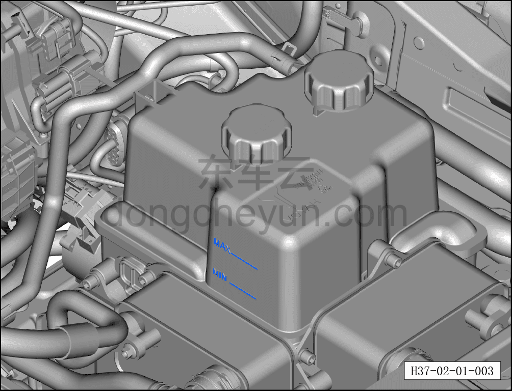
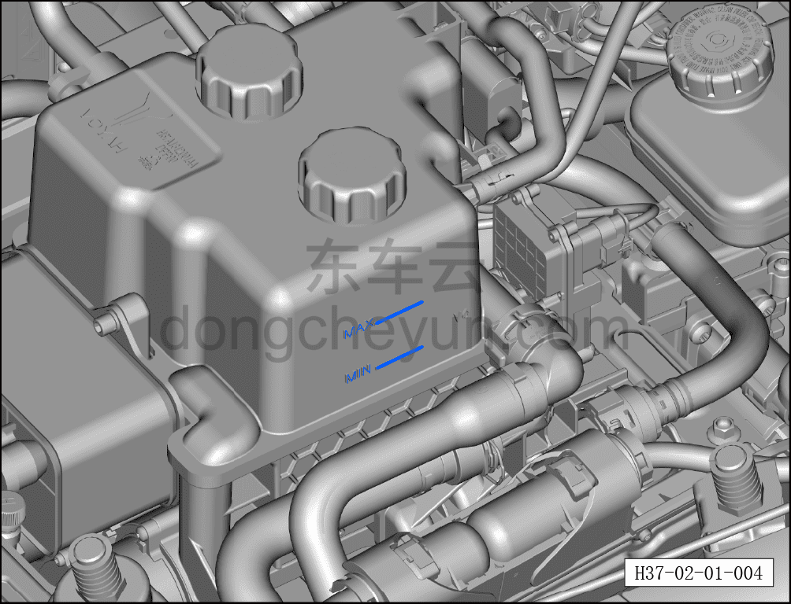
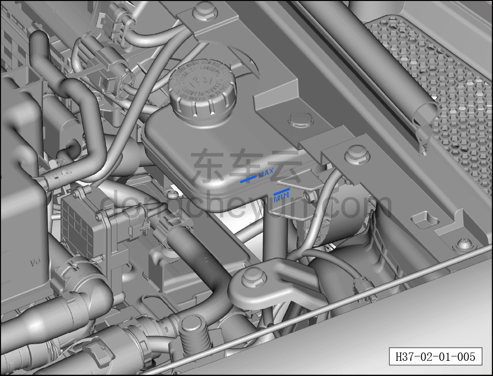

# Проверка уровня жидкостей

> Подготовка нового автомобиля › Технология подготовки › Порядок выполнения работ › Проверка переднего отсека  
> Оригинал: `液面检查` · [dongcheyun 56746](https://dongcheyun.com/p/56746), страница `10640e67964a41f297d7332516030d66` · [оглавление](../README.md)

Проверить соответствие уровня следующих жидкостей:

- Уровень жидкости омывателя лобового стекла.

● После подачи питания на автомобиль включить выключатель омывателя переднего/заднего стекла — должна распыляться жидкость; одновременно убедиться в нормальной работе насоса омывателя и трубопроводов. При недостатке жидкости долить омывающую жидкость той же марки и типа.

-Уровень охлаждающей жидкости тягового электродвигателя/тяговой батареи.

● На горизонтальной поверхности уровень жидкости должен находиться между отметками минимума (MIN) и максимума (MAX) на расширительном бачке (близко к верхней отметке).

● При недостаточном уровне долить охлаждающую жидкость той же марки. Если объём доливки превышает один литр, необходимо проверить систему охлаждения на наличие дефектов, приводящих к утечке. При необходимости провести удаление воздуха из системы охлаждения (см. соответствующую технологию).

- Уровень охлаждающей жидкости системы HVAC.

● На горизонтальной поверхности уровень жидкости должен находиться между отметками минимума (MIN) и максимума (MAX) на расширительном бачке (близко к верхней отметке).

● При недостаточном уровне долить охлаждающую жидкость той же марки. Если объём доливки превышает один литр, необходимо проверить систему охлаждения на наличие дефектов, приводящих к утечке. При необходимости провести удаление воздуха из системы охлаждения (см. соответствующую технологию).

- Уровень тормозной жидкости.

● Уровень жидкости должен находиться между отметками минимума (MIN) и максимума (MAX) на резервуаре.

● При недостаточном уровне долить тормозную жидкость той же марки до отметки максимума (MAX).

**Примечание: при необходимости доливки всех вышеуказанных жидкостей использовать жидкость той же спецификации.**

