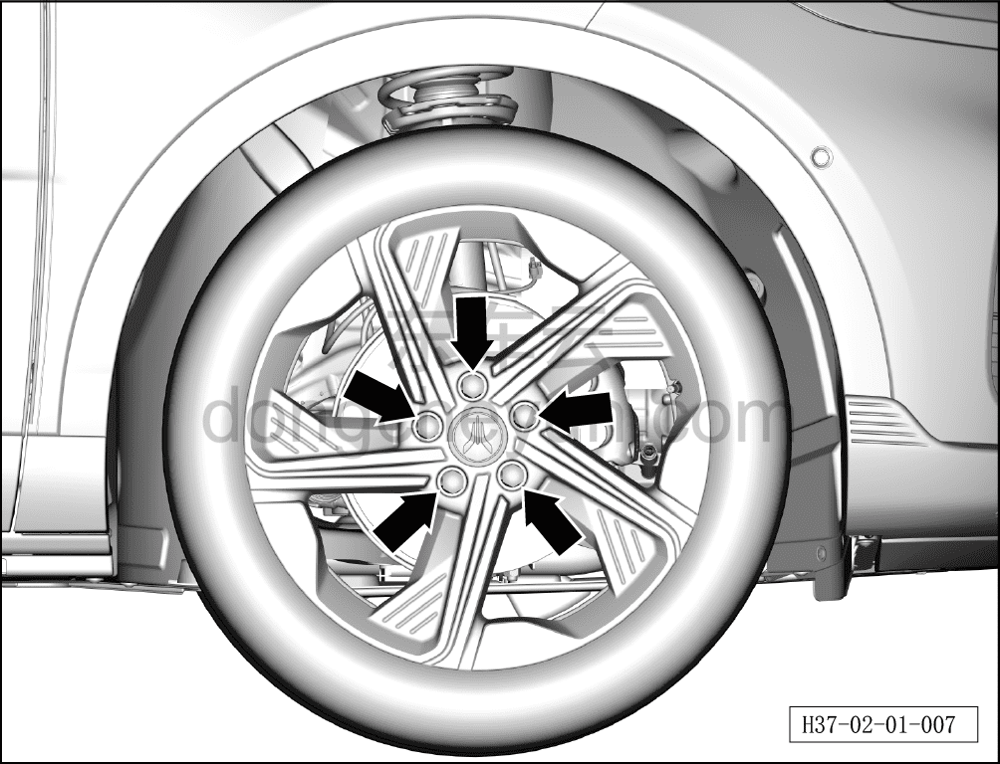
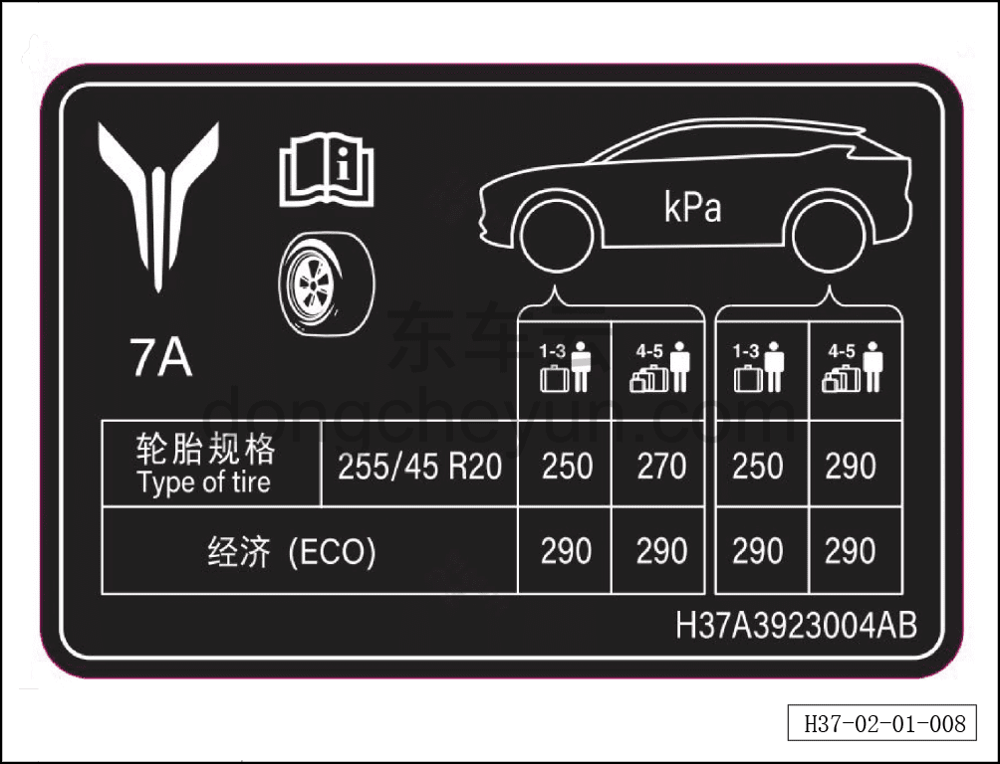

# Шины

> Подготовка нового автомобиля › Технология подготовки › Порядок выполнения работ › Наружный осмотр  
> Оригинал: `轮胎` · [dongcheyun 56746](https://dongcheyun.com/p/56746), страница `711d823c2bbe48d2b2a5d25a01e7984f` · [оглавление](../README.md)

-Проверить внешний вид дисков на отсутствие потёртостей и царапин.

- Проверить затяжку 5 болтов на каждом колесе. При несоответствии отрегулировать с нормативным моментом затяжки.

- Проверить давление в шинах: давление в передних и задних шинах устанавливать по табличке давления в шинах автомобиля, регулировать и подтверждать по значению давления при загрузке 1-3 человек (250 кПа), допустимое отклонение ±10 кПа.

- Проверить правильность установки декоративных колпаков колёсных дисков и декоративных колпачков болтов колёс.

**Примечание: см. табличку с указанием давления в шинах, наклеенную в нижней части левой стойки B автомобиля.**

