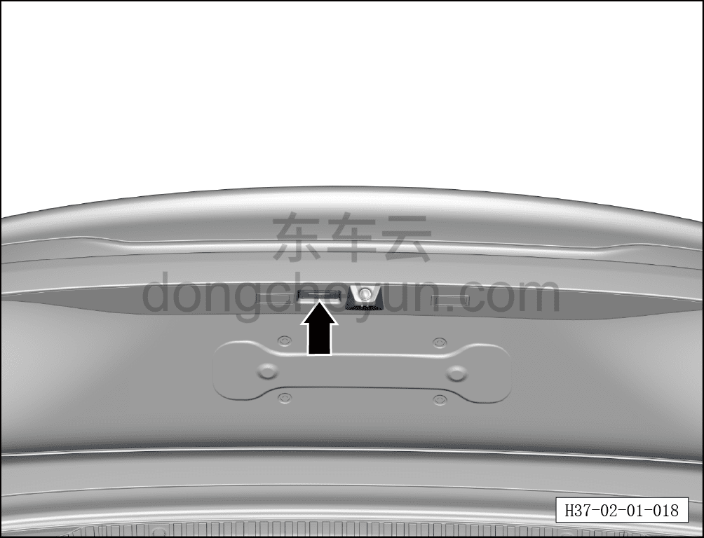

# Проверка открытия/закрытия передних/задних дверей, электропривода двери багажника, функции детского замка

> Подготовка нового автомобиля › Технология подготовки › Порядок выполнения работ › Наружный осмотр  
> Оригинал: `检查前/后车门、电动尾门开启/关闭、儿童锁功能` · [dongcheyun 56746](https://dongcheyun.com/p/56746), страница `5e4fbf9caa834bedb5ebd64b560baf41` · [оглавление](../README.md)

- Одновременно с использованием ключа открыть/закрыть передние/задние двери и электропривод двери багажника, проверить состояние открытия/закрытия передних/задних дверей и двери багажника (нормальная работа внутренних и наружных ручек дверей, наличие посторонних шумов при открытии/закрытии, нормальная работа шарниров, усилие закрывания двери, нормальная работа функции открытия/закрытия электропривода двери багажника и т.п.).

- Проверить работу выключателя электропривода двери багажника (после успешной проверки выключить выключатель электропривода двери багажника).

**Примечание: описание работы всех функций см. в руководстве пользователя.**

