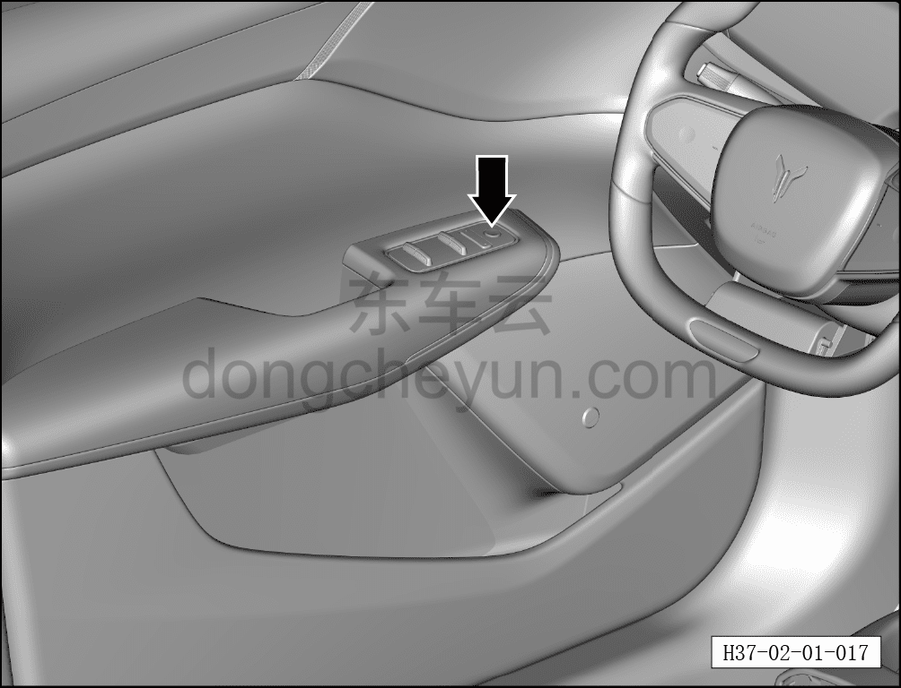

# Проверка кнопки детского замка безопасности

> Подготовка нового автомобиля › Технология подготовки › Порядок выполнения работ › Наружный осмотр  
> Оригинал: `检查儿童安全锁按键` · [dongcheyun 56746](https://dongcheyun.com/p/56746), страница `065c214408ac4ababff15d3a3f9d7921` · [оглавление](../README.md)

- Проверить работу детского замка задней двери (после успешной проверки отключить детский замок).

