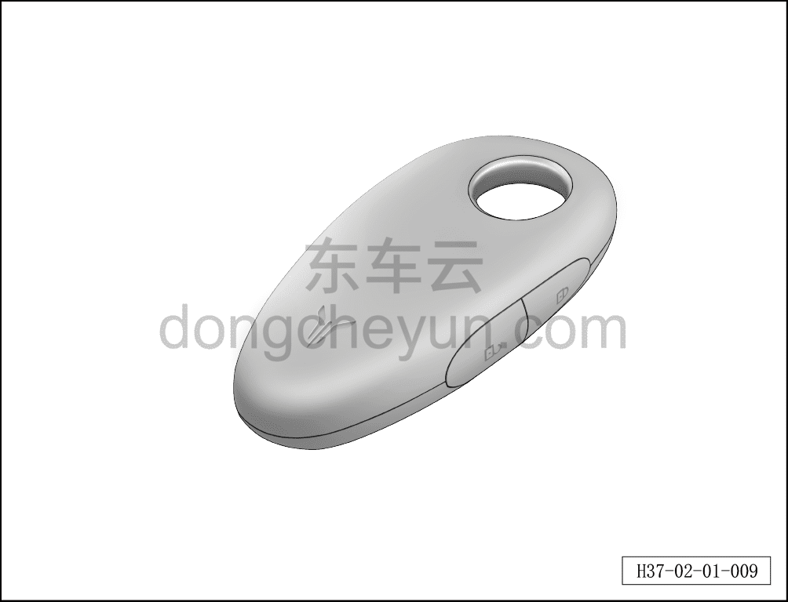

# Ключ

> Подготовка нового автомобиля › Технология подготовки › Порядок выполнения работ › Наружный осмотр  
> Оригинал: `钥匙` · [dongcheyun 56746](https://dongcheyun.com/p/56746), страница `60c0ea384a18426a8359c27b584442d0` · [оглавление](../README.md)

- На левой передней двери проверить функции разблокировки и блокировки всеми ключами автомобиля.

- Проверить функцию запуска автомобиля ключом и функцию противоугонной защиты автомобиля.

- Проверить функции блокировки и разблокировки всех дверей ключом.

- Проверить функцию открытия электропривода двери багажника ключом.

- Проверить функцию автоматического повторного включения блокировки.

**Примечание: описание работы ключа см. в руководстве пользователя.**

