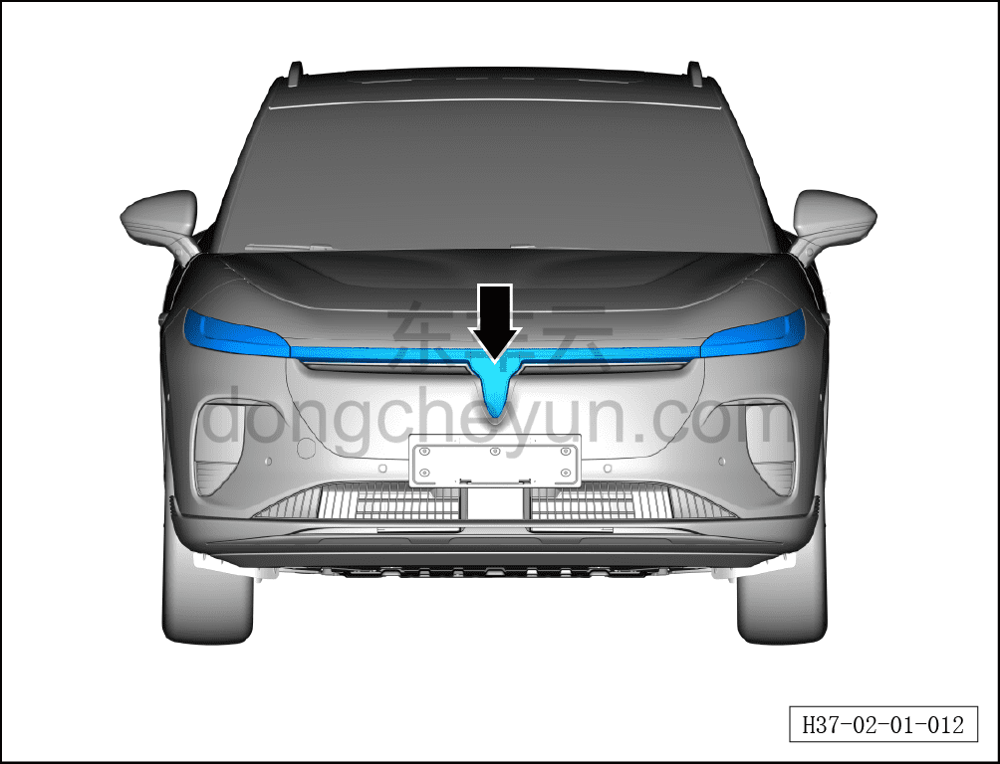
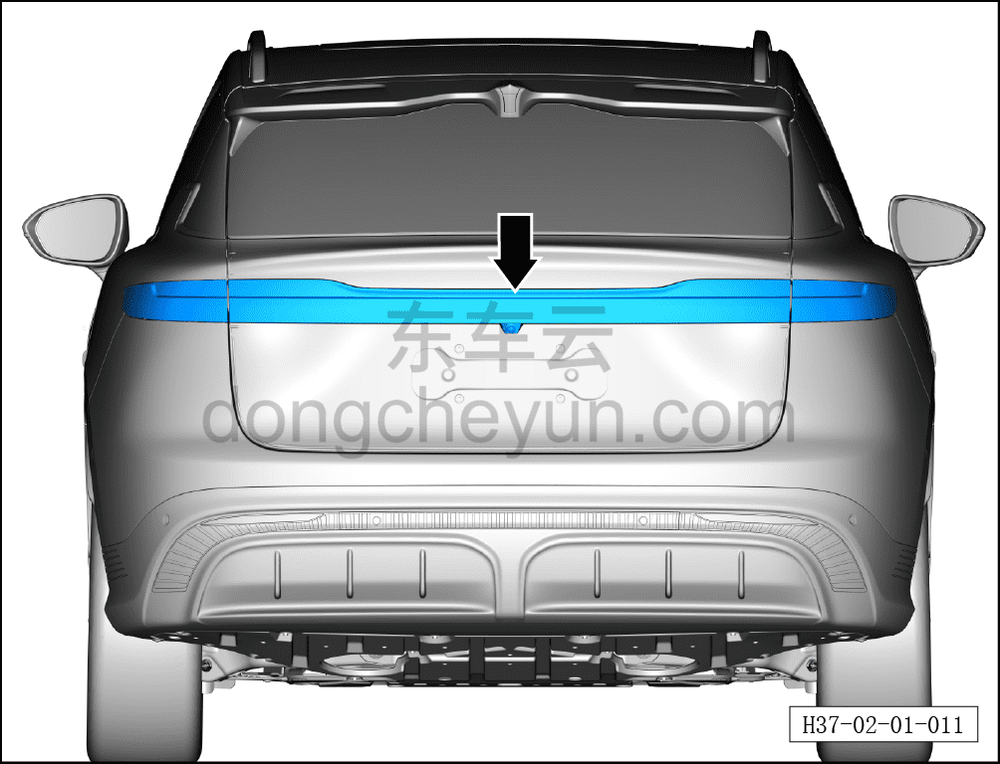

# Проверка освещения

> Подготовка нового автомобиля › Технология подготовки › Порядок выполнения работ › Осмотр салона  
> Оригинал: `灯光检查` · [dongcheyun 56746](https://dongcheyun.com/p/56746), страница `565845eac8a843bc883f62ecb290fa96` · [оглавление](../README.md)

-После подачи питания на автомобиль проверить внутренний потолочный свет, подсветку салона (ambient) и наружное освещение (постоянное горение, нормальная яркость).

**Примечание: способы включения/выключения всех световых приборов см. в руководстве пользователя.**

