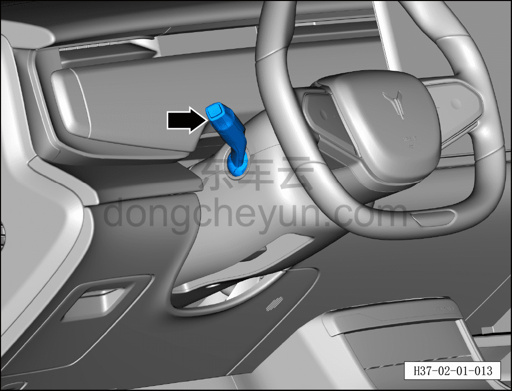

# Функция стеклоочистителя и омывателя

> Подготовка нового автомобиля › Технология подготовки › Порядок выполнения работ › Осмотр салона  
> Оригинал: `雨刮及洗涤器功能` · [dongcheyun 56746](https://dongcheyun.com/p/56746), страница `336b900e815c4a6a88398c4c70398162` · [оглавление](../README.md)

- Включить выключатель переднего стеклоочистителя, проверить нормальную работу механизма стеклоочистителя на всех режимах.

- При переключении механизма стеклоочистителя с низкой скорости на высокую качание рычага должно быть плавным, площадь очистки равномерной, без посторонних шумов.

- Перевести комбинированный переключатель стеклоочистителя назад до упора — форсунка начинает распылять омывающую жидкость, стеклоочиститель включается спустя некоторое время.

**Примечание: описание работы стеклоочистителя см. в руководстве пользователя. Категорически запрещается сухое протирание без жидкости.**

