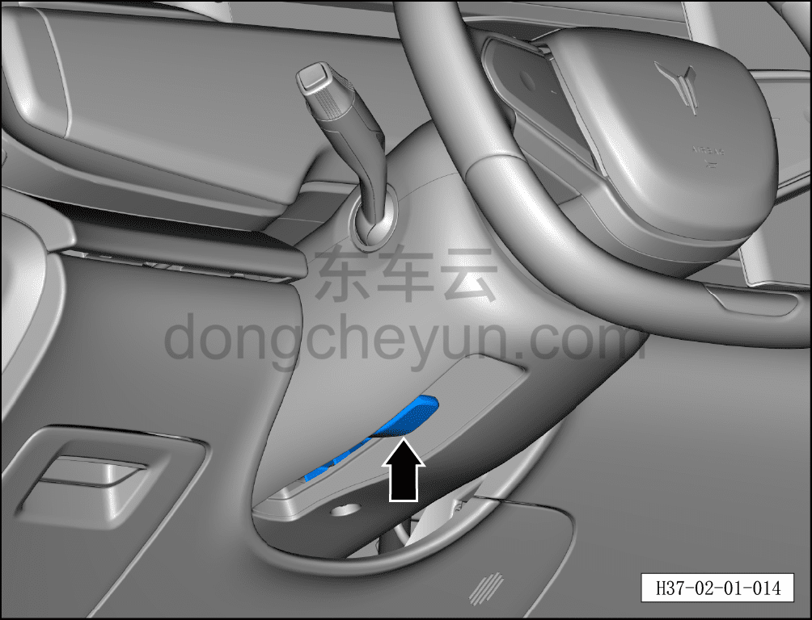

# Рулевое колесо

> Подготовка нового автомобиля › Технология подготовки › Порядок выполнения работ › Осмотр салона  
> Оригинал: `方向盘` · [dongcheyun 56746](https://dongcheyun.com/p/56746), страница `58a0220175624b9180be1753b75e8e82` · [оглавление](../README.md)

- Отпустить рычаг регулировочного устройства, проверить свободное перемещение рулевого колеса вверх-вниз и вперёд-назад без помех.

- Зафиксировать рычаг регулировочного устройства, проверить надёжность фиксации рулевого колеса в положении вверх-вниз и вперёд-назад.

- После завершения проверки установить рулевое колесо в крайнее переднее верхнее положение и зафиксировать.

