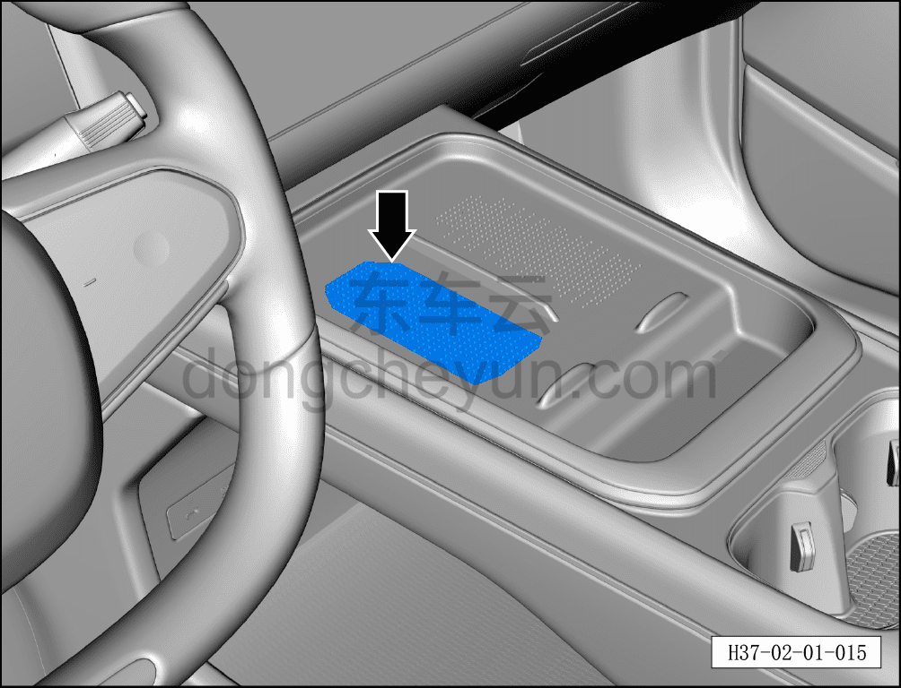

# Функция беспроводной зарядки

> Подготовка нового автомобиля › Технология подготовки › Порядок выполнения работ › Осмотр салона  
> Оригинал: `无线充电功能` · [dongcheyun 56746](https://dongcheyun.com/p/56746), страница `3f7adbc9abcd47e5be80757c8ce6a3fa` · [оглавление](../README.md)

- Включить функцию беспроводной зарядки, положить телефон с функцией беспроводной зарядки в зону беспроводной зарядки — загорается индикатор беспроводной зарядки (с иконкой молнии), что означает процесс зарядки.

