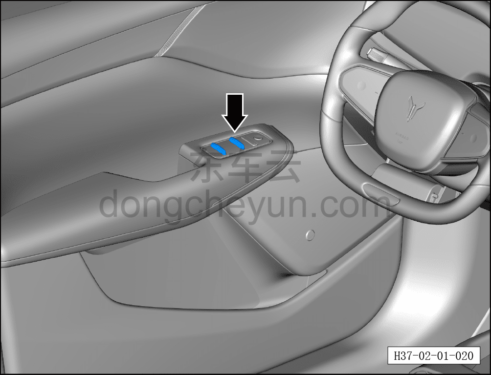

# Электрический стеклоподъёмник

> Подготовка нового автомобиля › Технология подготовки › Порядок выполнения работ › Осмотр салона  
> Оригинал: `电动玻璃升降器` · [dongcheyun 56746](https://dongcheyun.com/p/56746), страница `d63abb8e4243488294c4c0ae6c64354b` · [оглавление](../README.md)

- Подать питание на автомобиль.

- Проверить нормальную работу электрических стеклоподъёмников передних и задних дверей, отсутствие посторонних шумов.

- Проверить работоспособность кнопки блокировки стеклоподъёмников.

**Примечание: описание работы стеклоподъёмников см. в руководстве пользователя.**

