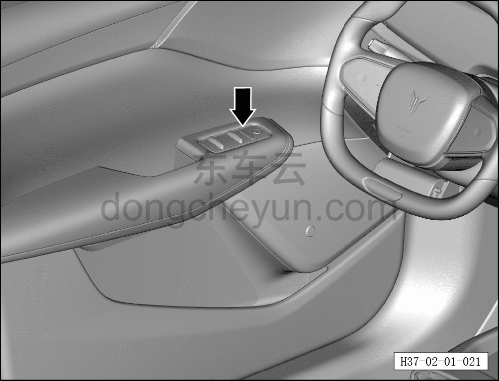

# Центральный замок дверей

> Подготовка нового автомобиля › Технология подготовки › Порядок выполнения работ › Осмотр салона  
> Оригинал: `中控门锁` · [dongcheyun 56746](https://dongcheyun.com/p/56746), страница `f5b5b5532d274e6199b342d7b11b9539` · [оглавление](../README.md)

- Подать питание на автомобиль.

- Нажать кнопки блокировки и разблокировки центрального замка на внутреннем подлокотнике левой передней двери.

- Проверить нормальную работу системы центрального замка дверей.

