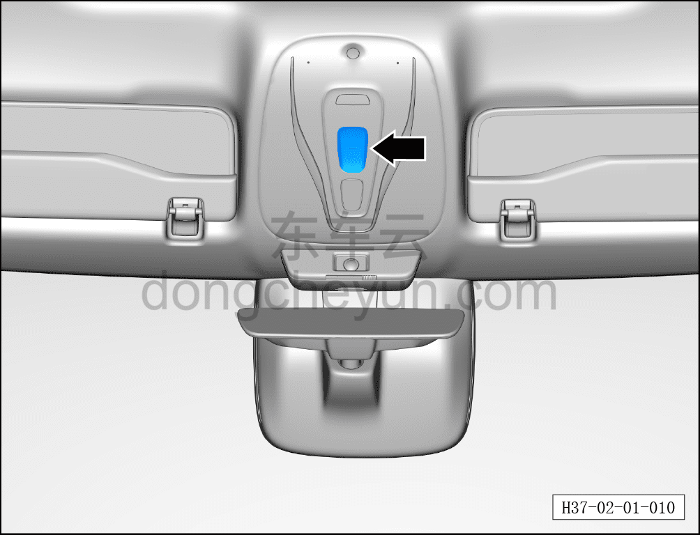

# Люк

> Подготовка нового автомобиля › Технология подготовки › Порядок выполнения работ › Осмотр салона  
> Оригинал: `天窗` · [dongcheyun 56746](https://dongcheyun.com/p/56746), страница `62e68e0859bc4834955095a9eb7d2f3a` · [оглавление](../README.md)

- Проверить функции открытия, приподнимания и закрытия люка.

- Проверить функцию защиты от защемления люка (обязательно соблюдать осторожность).

- Проверить функции открытия и закрытия шторки люка.

- После завершения проверки закрыть люк и шторку.

**Примечание: описание работы люка см. в руководстве пользователя.**

**Имитирующий препятствие предмет, используемый для проверки функции защиты от защемления стекла, должен иметь мягкую внешнюю оболочку, чтобы не допустить повреждения внешнего вида кузова от сдавливания. Категорически запрещается проверять функцию защиты от защемления какой-либо частью тела.**

