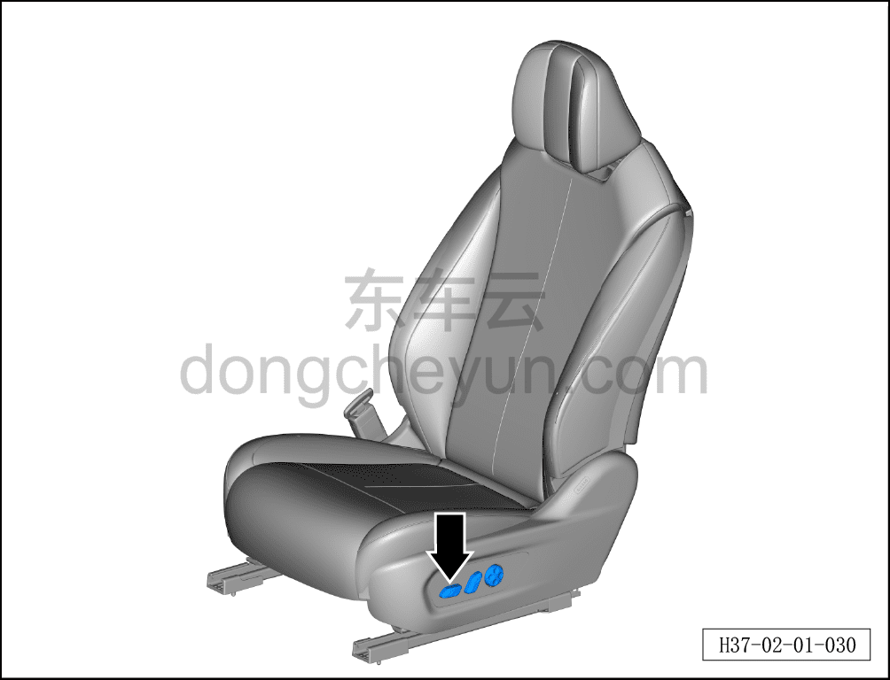

# Сиденья

> Подготовка нового автомобиля › Технология подготовки › Порядок выполнения работ › Осмотр салона  
> Оригинал: `座椅` · [dongcheyun 56746](https://dongcheyun.com/p/56746), страница `c089e43a514b41f99088ea51366eb010` · [оглавление](../README.md)

- Проверить функции регулировки сиденья, спинки, подголовника, подлокотника, а также функцию складывания заднего сиденья.

- Установить оба передних сиденья в одинаковое положение.

- Установить заднее сиденье в положение для сидения, подголовники заднего сиденья опустить в самое нижнее положение.

- Расположить ремни безопасности и замки заднего сиденья на видном месте.

**Примечание: при проверке функции складывания заднего сиденья одновременно убедиться, что свет в багажнике выключен.**

