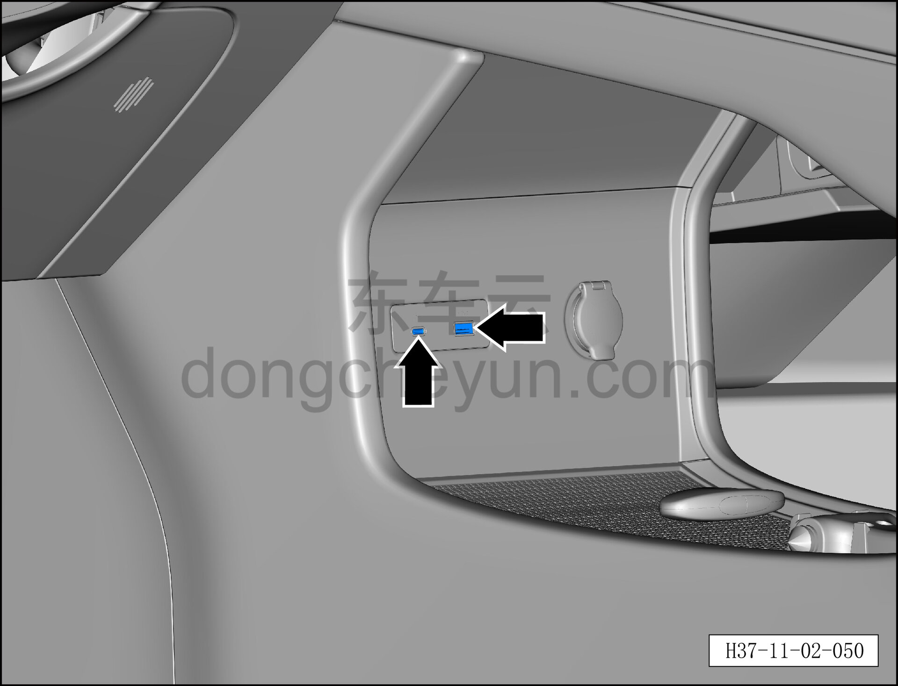

# Функция разъёма USB

> Подготовка нового автомобиля › Технология подготовки › Порядок выполнения работ › Осмотр салона  
> Оригинал: `USB电源接口功能` · [dongcheyun 56746](https://dongcheyun.com/p/56746), страница `da9e65aa7dab441fb163830acf09cf5a` · [оглавление](../README.md)

- После подачи питания на автомобиль подключить электроприбор к разъёму питания, проверить нормальность подачи питания.
