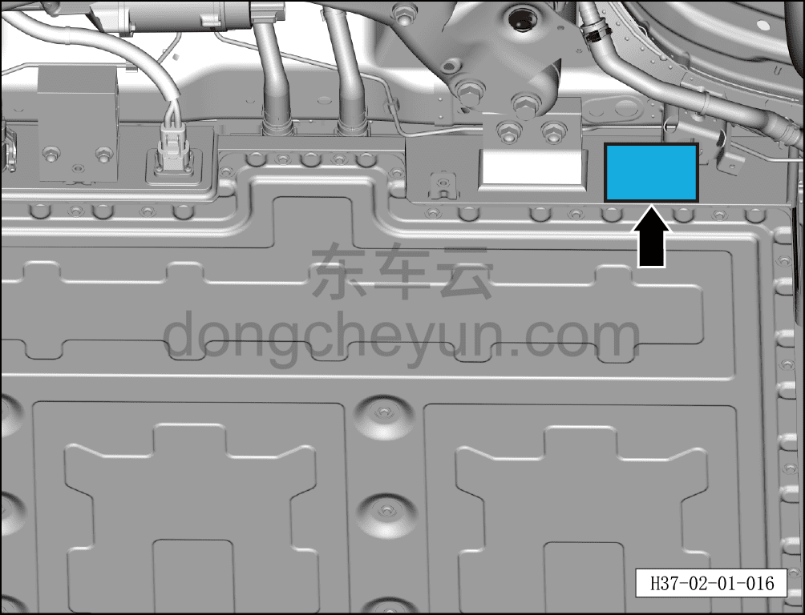

# Проверка на подъёмнике

> Подготовка нового автомобиля › Технология подготовки › Порядок выполнения работ  
> Оригинал: `举升检查` · [dongcheyun 56746](https://dongcheyun.com/p/56746), страница `e074bec021de463d9168bcdcbef01d1e` · [оглавление](../README.md)

С помощью подъёмного оборудования поднять автомобиль на подходящую высоту и проверить следующие пункты:

- Проверить маркировку тяговой батареи

● Снять центральный нижний защитный щиток, сверить соответствие заводского номера на табличке тяговой батареи.

- Проверить пыльник переднего амортизатора на отсутствие повреждений, амортизатор на отсутствие подтёков.

- Проверить шаровой шарнир рулевой тяги на отсутствие люфта.

- Проверить наличие следов масла в местах установки маслосъёмных уплотнений.

- Проверить пыльник рулевого механизма на наличие трещин и старения.

- Проверить шаровой шарнир стабилизатора поперечной устойчивости на отсутствие люфта, резиновые втулки на отсутствие повреждений.

- Проверить пыльник заднего амортизатора на отсутствие повреждений, амортизатор на отсутствие подтёков.

- Проверить шаровой шарнир нижнего рычага подвески на отсутствие люфта.

- Проверить тормозные трубопроводы на отсутствие подтёков и правильность установки.

- Проверить все 4 подшипника колёсных ступиц на отсутствие люфта и посторонних шумов; вращая колесо, проверить отсутствие подтормаживания.

- Вращая колесо, проверить состояние поверхности шины (рисунок протектора, износ, посторонние предметы, вздутия, трещины и т.п.).

- Визуально проверить внешний вид нижней части автомобиля на отсутствие потёртостей, царапин, трещин, деформации, повреждений, коррозии, дефектов, недостатков и т.п.
