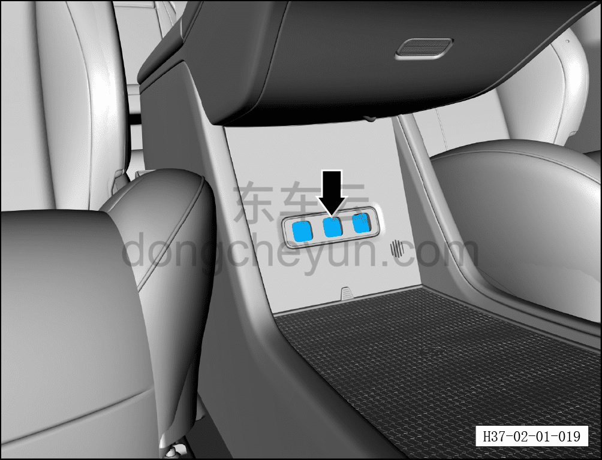

# Установка и проверка принадлежностей

> Подготовка нового автомобиля › Технология подготовки › Порядок выполнения работ › Итоговая проверка  
> Оригинал: `附件的安装和检查` · [dongcheyun 56746](https://dongcheyun.com/p/56746), страница `28bc21b2c9774f24b4d117e0bbb9f2c6` · [оглавление](../README.md)

- Ароматизатор поставляется вместе с автомобилем в генераторе ароматизации; установку выполняет техник сервисного центра.

● Снять заглушку ароматизатора, извлечь из генератора ароматизации 3 ароматических картриджа.

● Снять защитную плёнку с ароматических картриджей, затем установить их в генератор ароматизации, установить заглушку ароматизатора.

- Проверить соответствие видов опциональных принадлежностей заказу клиента.

- Проверить качество установки и работу опциональных принадлежностей.

**Примечание: соответствие функций принадлежностей см. в инструкции по установке и использованию принадлежностей.**
