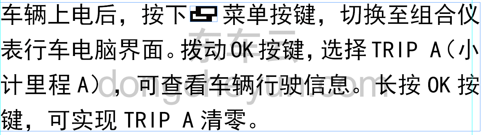

# Сбросить показания суточного счётчика пробега на ноль

> Подготовка нового автомобиля › Технология подготовки › Порядок выполнения работ › Итоговая проверка  
> Оригинал: `将小计里程表归零` · [dongcheyun 56746](https://dongcheyun.com/p/56746), страница `619db90dbe9145ba93055789fff6bf51` · [оглавление](../README.md)

