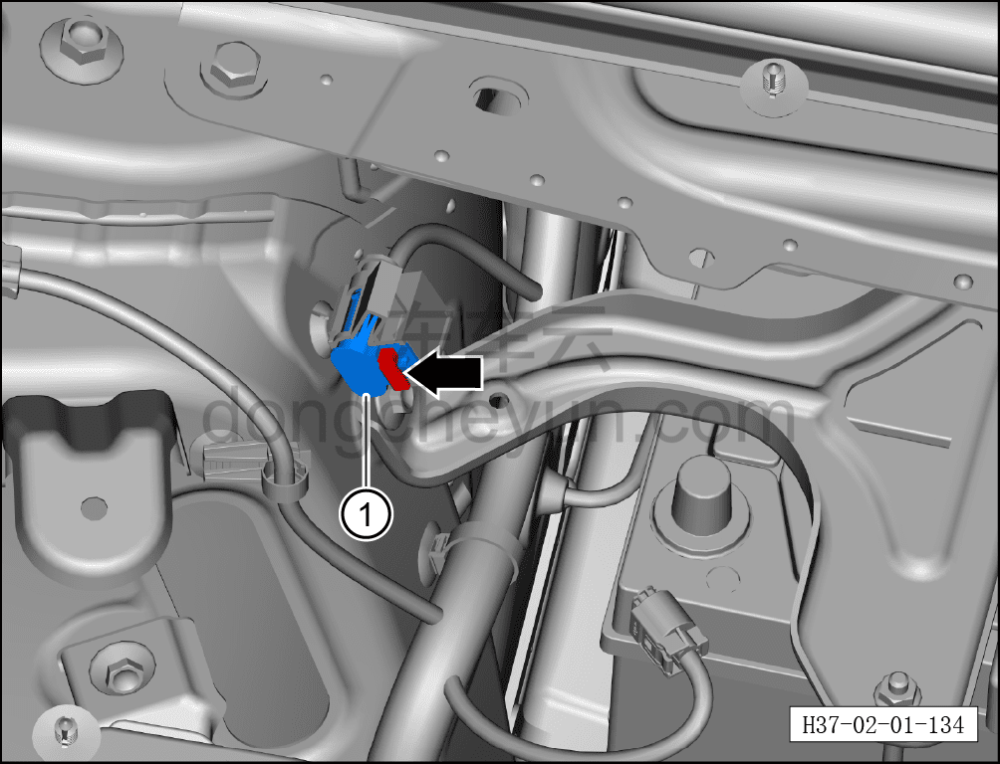
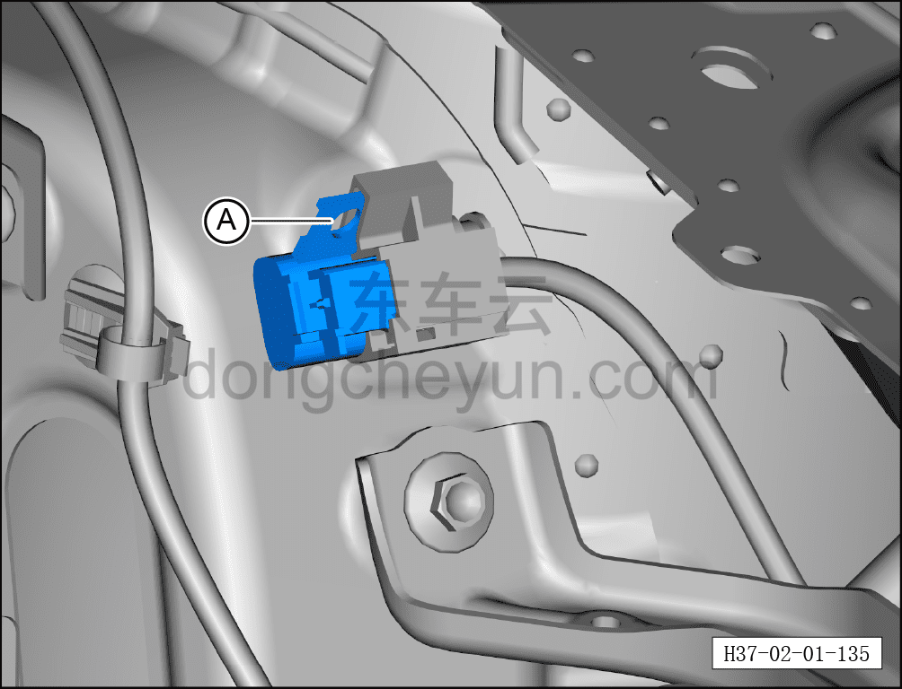
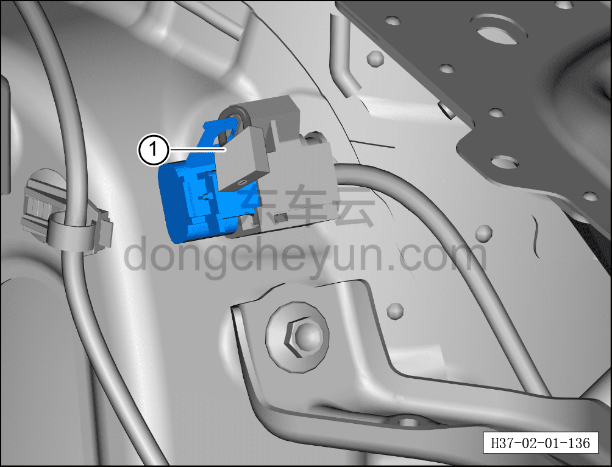
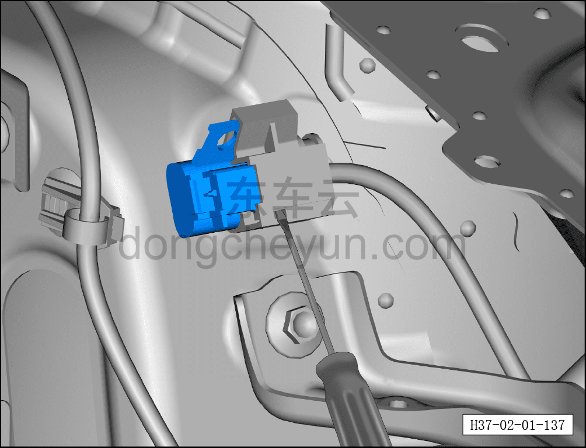
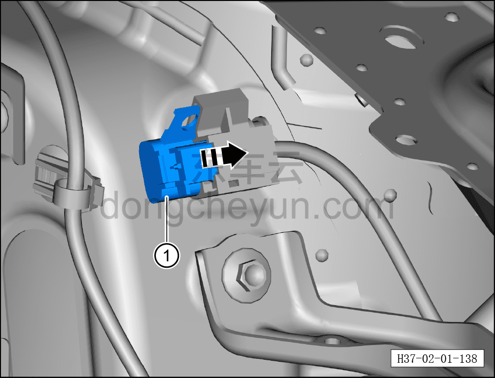
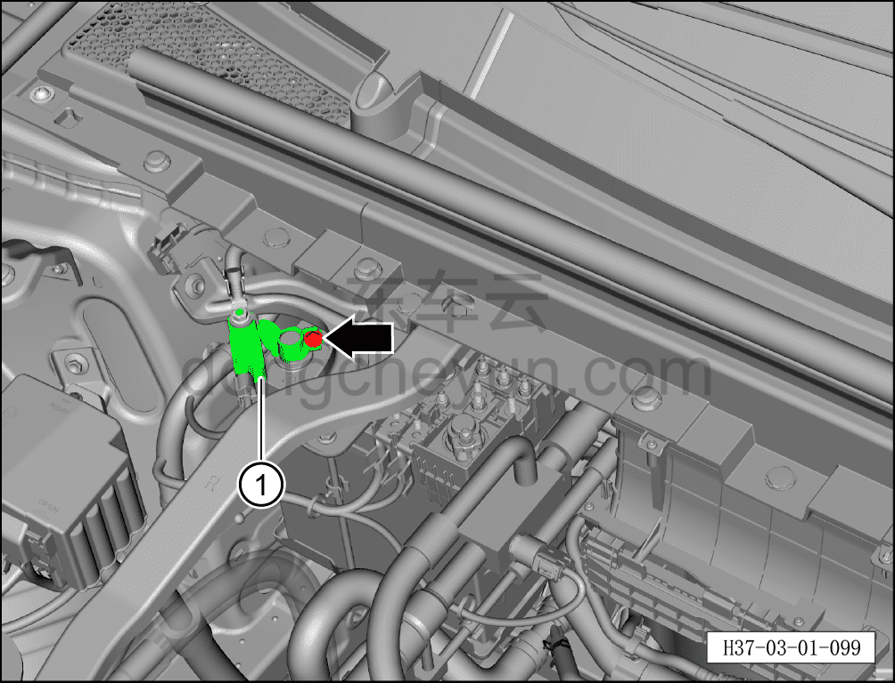

# Обесточивание автомобиля

> Техническое обслуживание › Техническое обслуживание › Операция обесточивания автомобиля  
> Оригинал: `车辆下电` · [dongcheyun 56746](https://dongcheyun.com/p/56746), страница `e003ce34be0f4c16b7485b3b3dfc51cb` · [оглавление](../README.md)

**Внимание:**

**-При выполнении ремонтных и обслуживающих работ на находящихся под напряжением электрических компонентах или окружающих их деталях для обеспечения безопасности ремонтного персонала необходимо выполнить обесточивание автомобиля.**

Порядок обесточивания

1. Выключить все электроприборы, обесточить автомобиль.

2. Дважды подряд потянуть рычаг открывания капота, открыть капот.

3. Заблокировать автомобиль с помощью пульта, подождать более 5 минут до завершения снятия высокого напряжения.

4. Отсоединить минусовой кабель аккумуляторной батареи.

a. Торцевой головкой 10 мм отвернуть крепёжную гайку минусового кабеля, отсоединить минусовой кабель аккумуляторной батареи ①.

**Внимание:**

**-После отсоединения минусового кабеля аккумуляторной батареи обмотать его изолирующей лентой, чтобы избежать случайного контакта и повреждения электрооборудования.**

5. Отсоединить сервисный разъединитель (MSD).

a. Нажать назад и отсоединить фиксатор разъёма сервисного разъединителя.

b. Отсоединить разъём сервисного разъединителя ① движением назад.

c. С помощью замка заблокировать разъём сервисного разъединителя в точке A.

**Внимание:**

**-После блокировки разъёма ключ от замка передать ответственному лицу для хранения.**

**-После отсоединения сервисного разъединителя подождать 5 мин, чтобы убедиться в полном разряде высоковольтной системы и отсутствии высокого напряжения.**

Порядок подачи питания

1. Установить сервисный разъединитель (MSD).

a. Разблокировать замок ① и снять его.

b. С помощью небольшой плоской отвёртки приподнять неправильно установленный фиксатор.

c. Вставить фиксатор сервисного разъединителя ① по направлению стрелки.

**Внимание:**

**-После завершения установки потянуть сервисный разъединитель назад, проверить надёжность его фиксации.**

2. Установить минусовую клемму аккумуляторной батареи.

a. Совместить минусовой кабель аккумуляторной батареи с клеммой батареи, установить и затянуть торцевой головкой 10 мм.

**Внимание:**

**-Подача питания на автомобиль обычно является последним этапом ремонтных работ; перед подачей питания необходимо согласовать с соответствующим персоналом наличие условий для подачи питания на автомобиль.**

**-После завершения процедуры подачи питания на автомобиль необходимо подключить диагностический сканер для считывания и очистки кодов неисправностей всего автомобиля.**
