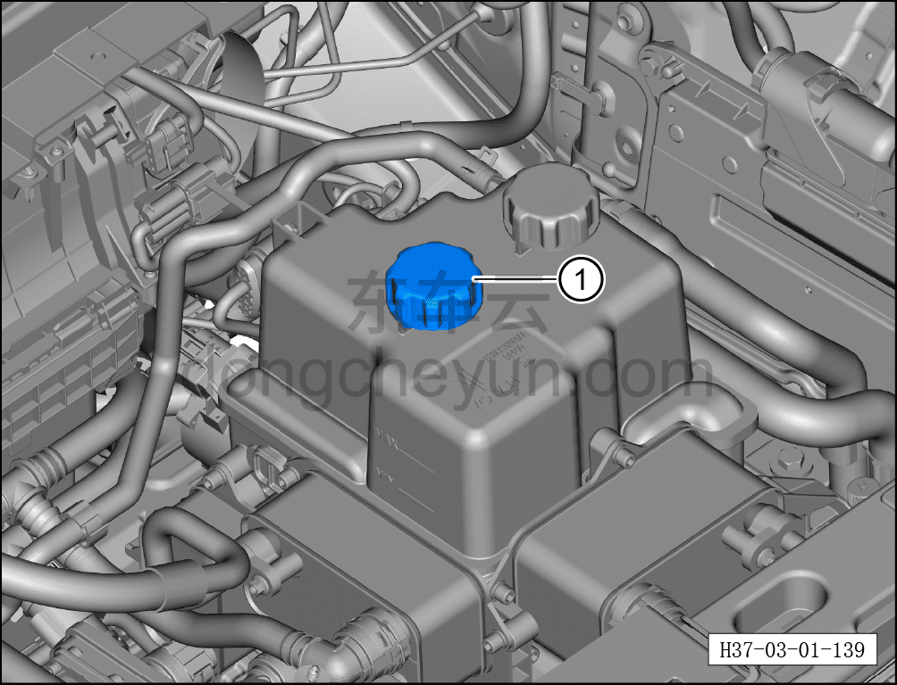
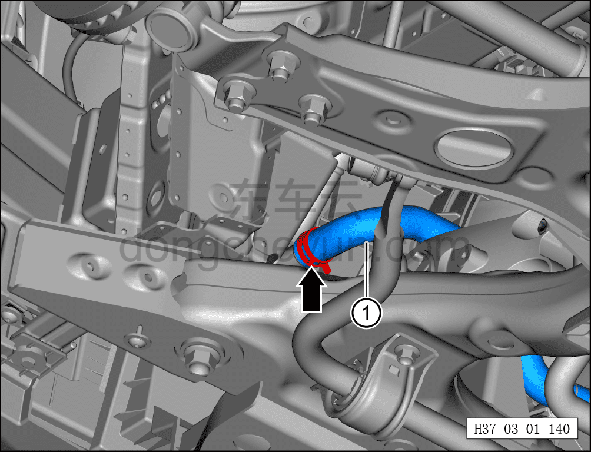
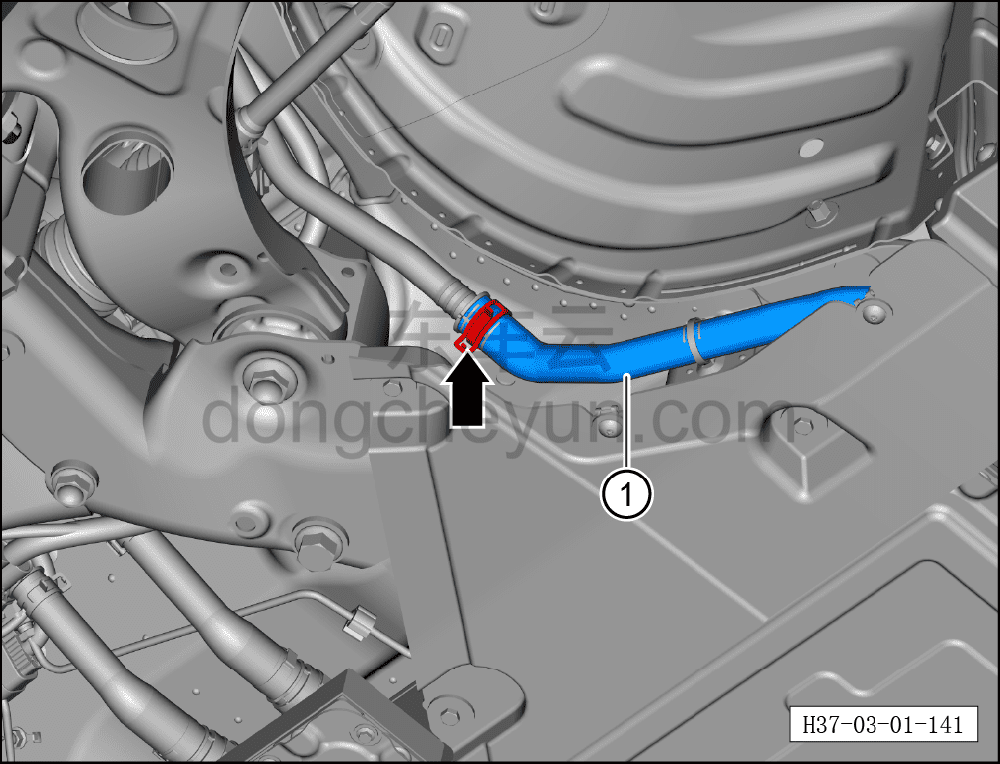
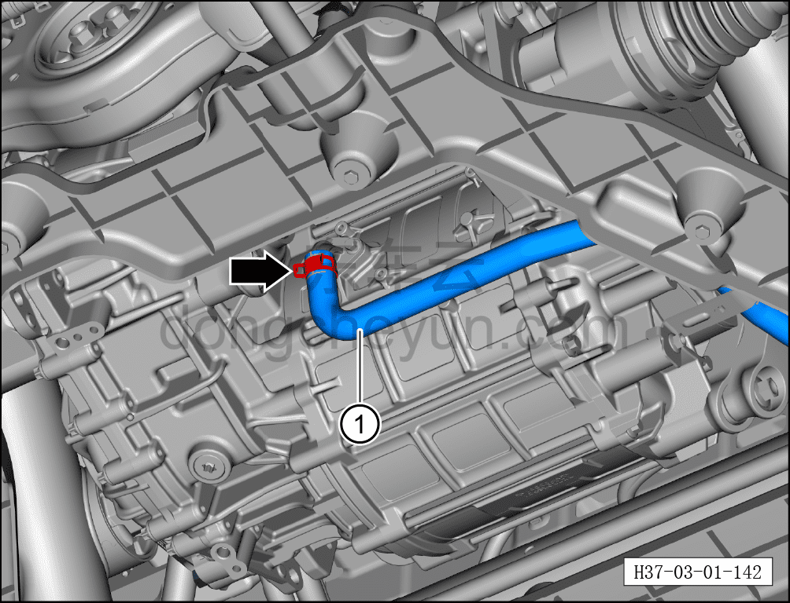
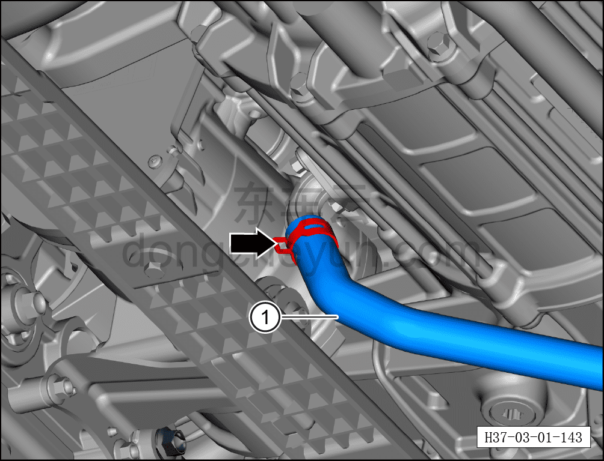
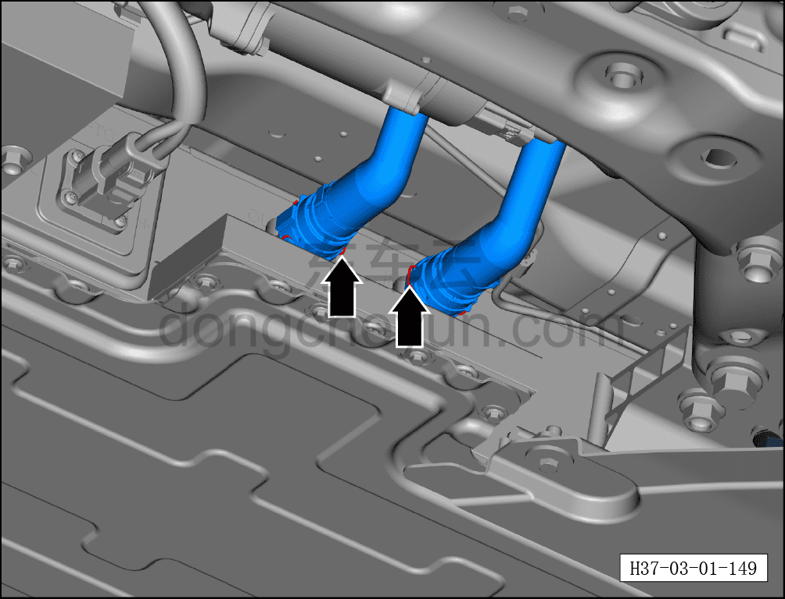
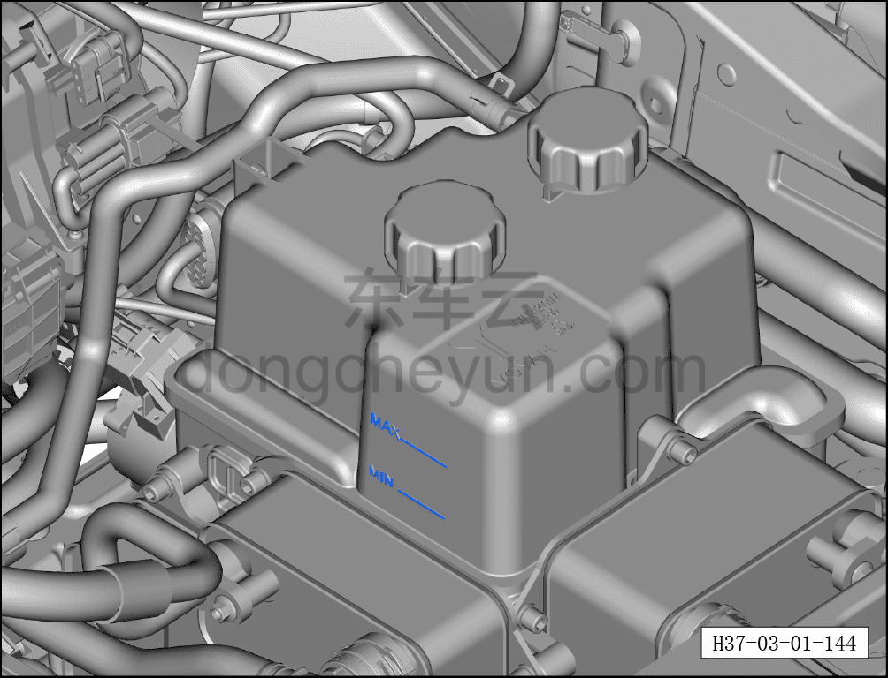

# Замена охлаждающей жидкости тягового электродвигателя и тяговой батареи

> Техническое обслуживание › Техническое обслуживание › Работы в нижней части автомобиля  
> Оригинал: `更换驱动电机和动力电池冷却液` · [dongcheyun 56746](https://dongcheyun.com/p/56746), страница `fa9733f858ae4bf88b0fd06caac78691` · [оглавление](../README.md)

При достижении периодичности технического обслуживания выполните процедуру замены охлаждающей жидкости тягового электродвигателя и тяговой батареи.

**Порядок слива**

**Примечание:**

**-Перед сливом охлаждающей жидкости необходимо подождать её полного охлаждения.**

**-При открытии крышки интегрированного расширительного бачка может выделяться горячий пар; примите меры защиты, чтобы не повредить глаза и не получить ожог кожи. Перед открытием крышки накройте её тряпкой и осторожно медленно отвинтите.**

1. Выключить все электроприборы, обесточить автомобиль.

2. Отсоединить минусовую клемму аккумуляторной батареи.

3. Заменить охлаждающую жидкость тягового электродвигателя и тяговой батареи.

a. Отвернуть крышку интегрированного расширительного бачка ①.

b. Установить ёмкость для сбора охлаждающей жидкости под выходную трубку низкотемпературного радиатора.

c. С помощью клещей для хомутов ослабить фиксирующий хомут и отсоединить шланг ①, слить охлаждающую жидкость до тех пор, пока она не начнёт вытекать по каплям, затем вновь вставить шланг и установить фиксирующий хомут.

**Примечание:**

**-Вытереть охлаждающую жидкость вокруг трубопровода, чтобы не мешать его осмотру.**

d. Установить ёмкость для сбора охлаждающей жидкости под жёсткую впускную трубку среднего канала OBC.

e. С помощью клещей для хомутов ослабить фиксирующий хомут и отсоединить шланг ①, слить охлаждающую жидкость до тех пор, пока она не начнёт вытекать по каплям, затем вновь вставить шланг и установить фиксирующий хомут.

**Примечание:**

**-Вытереть охлаждающую жидкость вокруг трубопровода, чтобы не мешать его осмотру.**

f. Установить ёмкость для сбора охлаждающей жидкости под выходную трубку заднего электродвигателя.

g. С помощью клещей для хомутов ослабить фиксирующий хомут и отсоединить шланг ①, слить охлаждающую жидкость до тех пор, пока она не начнёт вытекать по каплям, затем вновь вставить шланг и установить фиксирующий хомут.

**Примечание:**

**-Вытереть охлаждающую жидкость вокруг трубопровода, чтобы не мешать его осмотру.**

**Примечание:**

**-Операция слива через впускную трубку переднего электродвигателя применима только для полноприводных (AWD) версий.**

h. Установить ёмкость для сбора охлаждающей жидкости под впускную трубку переднего электродвигателя.

i. С помощью клещей для хомутов ослабить фиксирующий хомут и отсоединить шланг ①, слить охлаждающую жидкость до тех пор, пока она не начнёт вытекать по каплям, затем вновь вставить шланг и установить фиксирующий хомут.

**Примечание:**

**-Вытереть охлаждающую жидкость вокруг трубопровода, чтобы не мешать его осмотру.**

j. Установить ёмкость для сбора охлаждающей жидкости под шланг тяговой батареи.

k. Плоской отвёрткой отжать хомут шланга и отсоединить впускной/выпускной шланг тяговой батареи, слить охлаждающую жидкость до тех пор, пока она не начнёт вытекать по каплям, затем вновь вставить шланг и установить фиксирующий хомут.

**Примечание:**

**-Вытереть охлаждающую жидкость вокруг трубопровода, чтобы не мешать его осмотру.**

4. Заправка охлаждающей жидкости:

a. Медленно доливать охлаждающую жидкость до верхней отметки MAX на интегрированном расширительном бачке.

b. Установить крышку интегрированного расширительного бачка.

c. После завершения заправки нажать «Безопасное обслуживание» на центральном дисплее, открыть «Заправка охлаждающей жидкости» в разделе обслуживания автомобиля — режим заправки продлится 4 мин.

d. Снова долить охлаждающую жидкость до верхней отметки MAX интегрированного расширительного бачка, запустить режим заправки не менее 4 раз, пока при последнем запуске уровень охлаждающей жидкости не перестанет снижаться.

**Внимание:**

**-Во время работы режима заправки не выполняйте никаких действий с автомобилем, чтобы не прервать режим заправки.**

**-Обязательно используйте охлаждающую жидкость указанной производителем марки.**

**-После завершения заправки проверьте все соединения трубопроводов на отсутствие подтёков; при их обнаружении необходимо переустановить трубопровод.**
