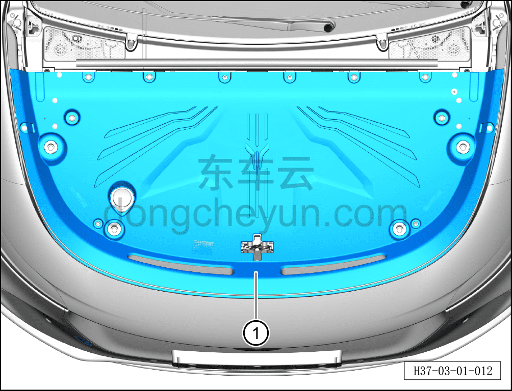
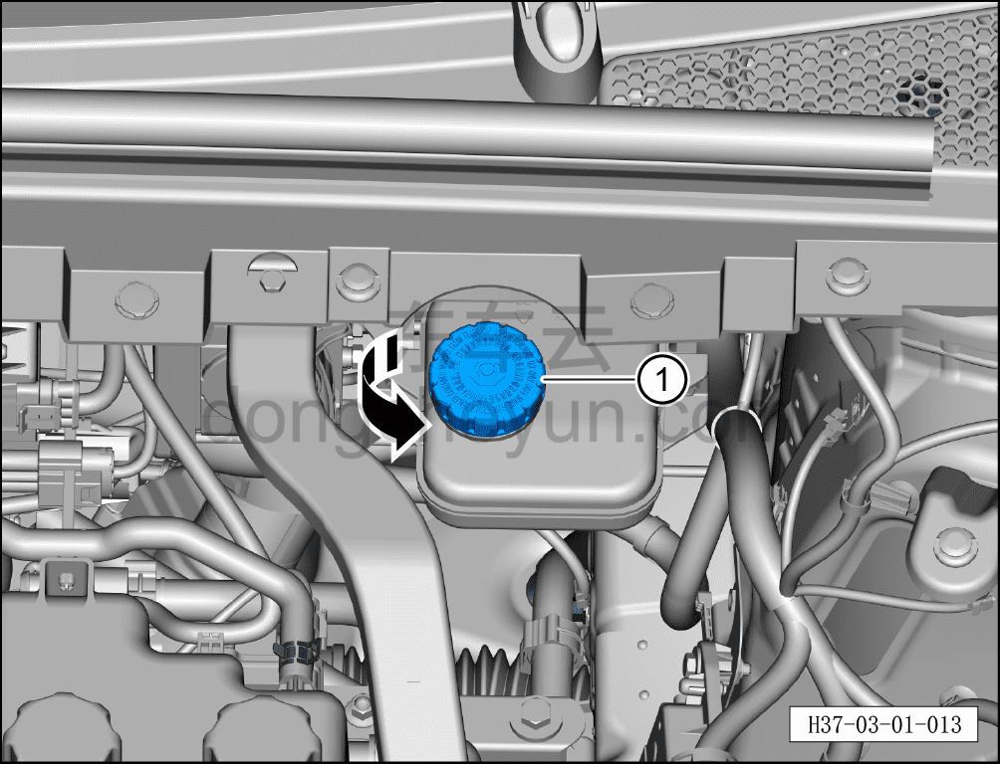
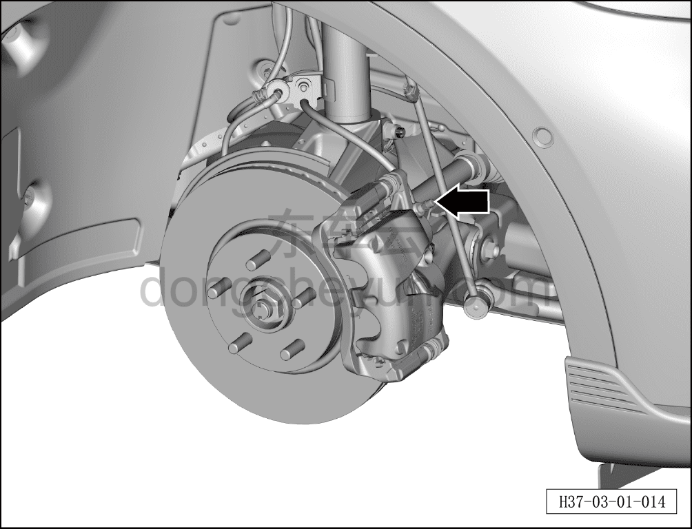
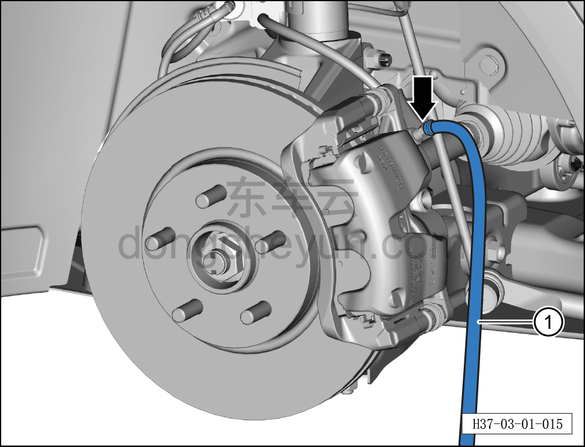
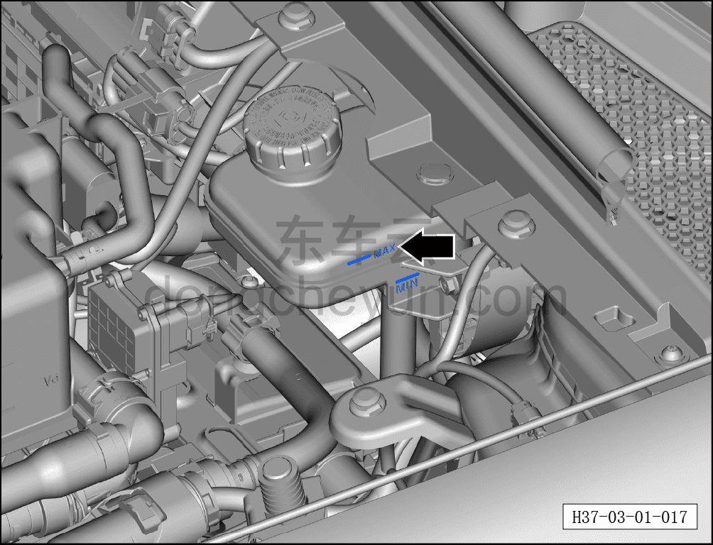

# Замена тормозной жидкости

> Техническое обслуживание › Техническое обслуживание › Работы в нижней части автомобиля  
> Оригинал: `更换制动液` · [dongcheyun 56746](https://dongcheyun.com/p/56746), страница `863f4942c96b4a3ebb118025c183b6aa` · [оглавление](../README.md)

**Внимание:**

**-Строго следуйте указаниям диагностического сканера, во время работы следите за параметрами на диагностическом сканере.**

**-При выполнении прокачки не нажимайте на педаль тормоза слишком сильно — избыточное усилие может привести к чрезмерному внутреннему давлению в IPB и сбою.**

**-Если клапан закрыт и педаль тормоза не нажимается, подождите открытия клапана, прежде чем нажимать педаль тормоза.**

**-Если прокачка не удалась, интервал между первой и второй попыткой прокачки должен составлять около 10 минут, иначе сработает защита от перегрева клапана IPB, что приведёт к сбою.**

**-При прокачке необходимо открывать соответствующий болт выпуска воздуха суппорта в соответствии с указаниями диагностического сканера, причём открывать его как можно шире, иначе может возникнуть избыточное внутреннее давление и сбой прокачки.**

**-Во время выполнения прокачки крышка резервуара не должна быть закручена в течение всей операции — воздух из клапана должен выходить через горловину резервуара.**

**-Во время выполнения прокачки необходимо в течение всей операции следить, чтобы уровень тормозной жидкости в резервуаре не опускался ниже отметки MIN, иначе легко произойдёт сбой прокачки.**

**-Если тормозная жидкость во всём автомобиле слита и заменён контроллер IPB, для полного удаления воздуха необходимо выполнить прокачку два раза; выполнение только одной прокачки приведёт к тому, что IPB выдаст ошибку утечки.**

При достижении периодичности технического обслуживания выполните процедуру замены тормозной жидкости.

**Примечание:**

**-При замене тормозной жидкости обязательно использовать тормозную жидкость, одобренную настоящей компанией.**

**-Никогда не смешивайте тормозную жидкость с другими минеральными маслами — другие минеральные масла повреждают уплотнения тормозной системы.**

**-Тормозная жидкость токсична и обладает коррозионным действием, не допускайте её контакта с лакокрасочным покрытием кузова.**

**-Тормозная жидкость сильно гигроскопична и поглощает влагу из окружающей среды, поэтому её необходимо хранить в герметичной таре.**

1. Замена тормозной жидкости

a. Снять декоративную панель моторного отсека ①.

b. Отвернуть крышку резервуара тормозной жидкости ① по направлению стрелки.

c. Откачать тормозную жидкость из резервуара.

d. Долить новую тормозную жидкость в резервуар.

e. Замену тормозной жидкости выполняют совместно два техника.

f. Поднять автомобиль на подъёмнике.

g. Снять защитный колпачок сливного болта тормозного суппорта.

h. Установить сливной шланг и ёмкость ①.

i. Ослабить сливной болт тормозного суппорта; один техник в салоне нажимает педаль тормоза, второй техник снизу ослабляет/затягивает сливной болт.

j. В порядке: правое переднее, левое переднее, правое заднее, левое заднее колесо — последовательно заменить тормозную жидкость, пока в тормозных трубопроводах не перестанут появляться пузырьки воздуха и жидкость не станет прозрачной.

**Внимание:**

**-При замене тормозной жидкости следите, чтобы уровень новой залитой жидкости в резервуаре не опускался ниже отметки «MIN» (минимум).**

**-Перед установкой сливного шланга необходимо очистить грязь вокруг болта выпуска воздуха.**

k. Долить тормозную жидкость до уровня, указанного стрелкой у отметки «MAX» (максимум) на резервуаре.

2. Прокачка тормозной жидкости

**Примечание:**

**-При ремонте, связанном с заменой тормозной жидкости, главного тормозного цилиндра, рабочих тормозных цилиндров, тормозных трубопроводов, обязательно выполнять прокачку.**

a. Подать питание на автомобиль, подключить диагностический сканер.

b. Войти в модуль интегрированного управления тормозами (IPB), нажать «Управление процедурами», нажать «Заправка и прокачка тормозной жидкости IPB», выполнить операцию согласно указаниям диагностического сканера, завершить прокачку.

**Внимание:**

**-В процессе прокачки следить за уровнем тормозной жидкости в резервуаре; при опускании ниже отметки MIN своевременно доливать.**

**-После завершения прокачки необходимо провести дорожное испытание автомобиля со скоростью 20–80 км/ч, во время которого выполнить не менее 5 полных экстренных торможений; при каждом тестовом торможении необходимо убедиться в нормальной работе тормозной системы — отсутствии задержки торможения, неэффективности торможения, чрезмерного тормозного пути и других отклонений. Если во время испытания выявлено хотя бы одно отклонение при торможении, необходимо повторно проверить всю тормозную систему.**
