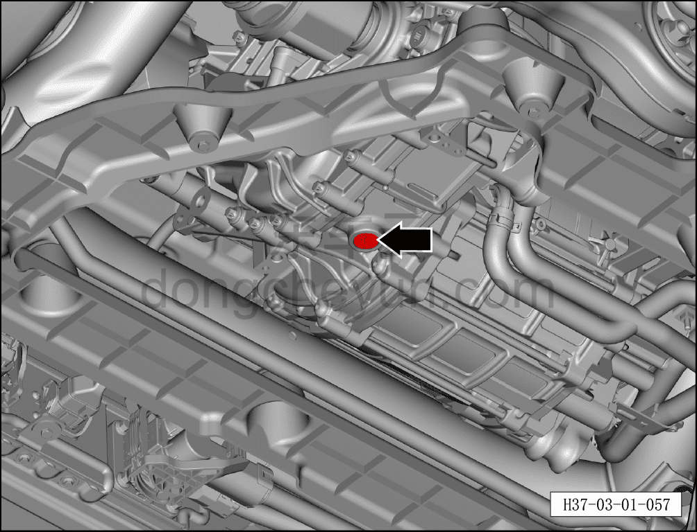
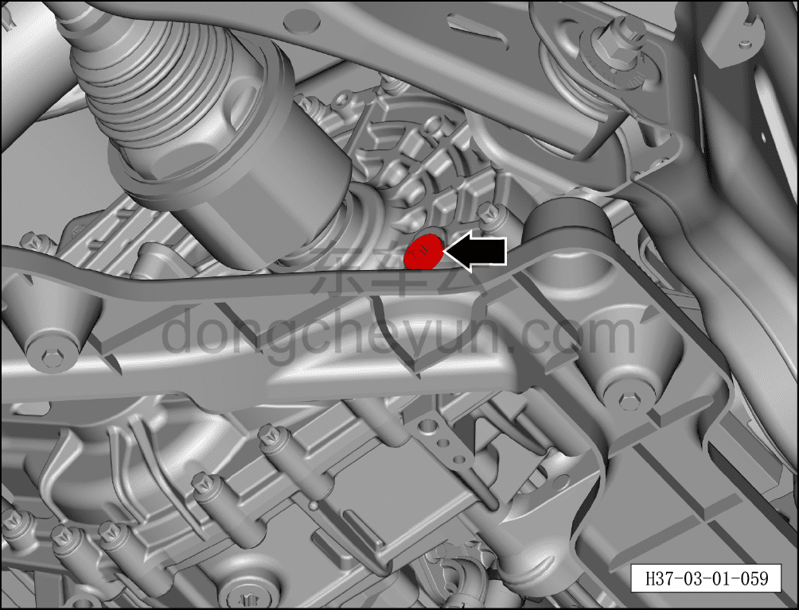

# Замена смазочного масла заднего тягового электродвигателя в сборе

> Техническое обслуживание › Техническое обслуживание › Работы в нижней части автомобиля  
> Оригинал: `更换后驱动电机总成润滑油` · [dongcheyun 56746](https://dongcheyun.com/p/56746), страница `f12254f3c3504df18a6821c2c4732d09` · [оглавление](../README.md)

При достижении периодичности технического обслуживания выполните процедуру замены смазочного масла редуктора заднего тягового электродвигателя в сборе.

**Внимание**

**-Соблюдайте правила утилизации отходов!**

**-Заливную пробку и уплотнительную шайбу, сливную пробку и уплотнительную шайбу повторно не использовать.**

**-При замене смазочного масла заднего тягового электродвигателя в сборе необходимо использовать указанное масло.**

**-Заливать масло через заливное отверстие до лёгкого перелива; когда перелив остановится и уровень масла окажется на одном уровне с заливным отверстием, масло достигнет нормативного уровня.**

**Слив**

1. Выключить все электроприборы, обесточить автомобиль.

2. Отсоединить минусовую клемму аккумуляторной батареи.

3. Поднять автомобиль на подъёмнике.

4. Снять задний нижний защитный щиток. См. [8.6.4.4 Снятие и установка заднего нижнего защитного щитка](../08-внутренняя-и-внешняя-отделка/194-снятие-и-установка-заднего-нижнего-защитного-щитка.md)

5. Слить смазочное масло заднего тягового электродвигателя в сборе.

a. Отвернуть сливную пробку заднего тягового электродвигателя в сборе, слить смазочное масло в мерную ёмкость.

b. После слива смазочного масла электродвигателя закрутить сливную пробку.

Момент затяжки сливной пробки: 6–8 Н·м

**Внимание -Сливная пробка является одноразовой деталью, повторно не использовать.**

**-В процессе работы масло должно храниться надлежащим образом, не допускать проливания, разбрызгивания, что может привести к травмам.**

**Заправка**

1. Заправить смазочное масло заднего тягового электродвигателя в сборе.

2. Спецификация смазочного масла заднего тягового электродвигателя в сборе: CASTROL BOT 805C EV

3. Справочный объём заправки (общий): 0,85±0,05 л

a. Очистить поверхность заливной пробки от пыли и загрязнений.

b. Отвернуть заливную пробку.

c. Вставить оборудование для заправки смазочного масла в заливное отверстие заднего тягового электродвигателя в сборе, заправить смазочное масло.

d. После завершения заправки установить новую заливную пробку.

-Момент затяжки заливной пробки: 7±1 Н·м

**Внимание**

**-Заливная пробка является одноразовой деталью, повторно не использовать.**

**-Внутренняя конструкция заднего тягового электродвигателя в сборе предъявляет высокие требования к чистоте масла; если в масле присутствуют примеси, пыль и т.п., после попадания внутрь заднего тягового электродвигателя в сборе это легко может привести к неисправности автомобиля и невозможности движения.**

**-В связи с особенностями конструкции данной модели при заправке смазочного масла заднего тягового электродвигателя в сборе необходимо использовать оборудование для заправки смазочного масла.**

**-Недостаточная или избыточная заправка смазочного масла заднего тягового электродвигателя в сборе повлияет на его работу.**
