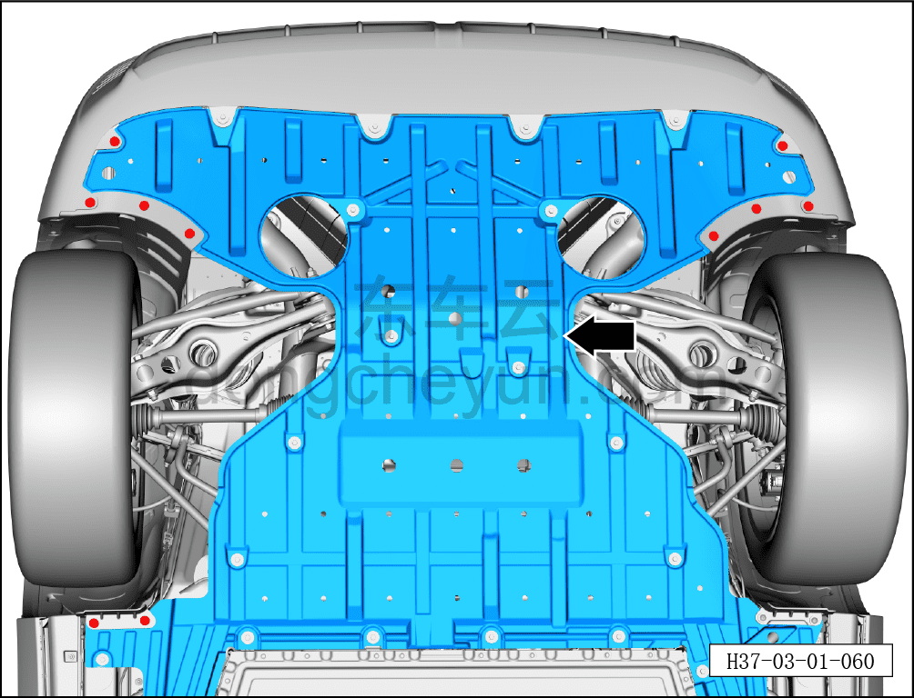
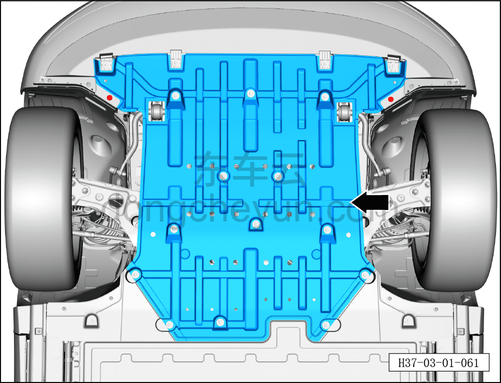

# Проверка защитных щитков пола кузова

> Техническое обслуживание › Техническое обслуживание › Работы в нижней части автомобиля  
> Оригинал: `检查车身地板护板` · [dongcheyun 56746](https://dongcheyun.com/p/56746), страница `794c224d61314ee69c23452516e85c24` · [оглавление](../README.md)

1. Поднять автомобиль на подъёмнике.

2. Проверить защитные щитки кузова

a. Проверить передний нижний защитный щиток на отсутствие повреждений и ослабления крепления; при обнаружении своевременно отремонтировать, а если ремонт невозможен — своевременно сообщить пользователю и заменить.

b. Проверить задний нижний защитный щиток на отсутствие повреждений и ослабления крепления; при обнаружении своевременно отремонтировать, а если ремонт невозможен — своевременно сообщить пользователю и заменить.
