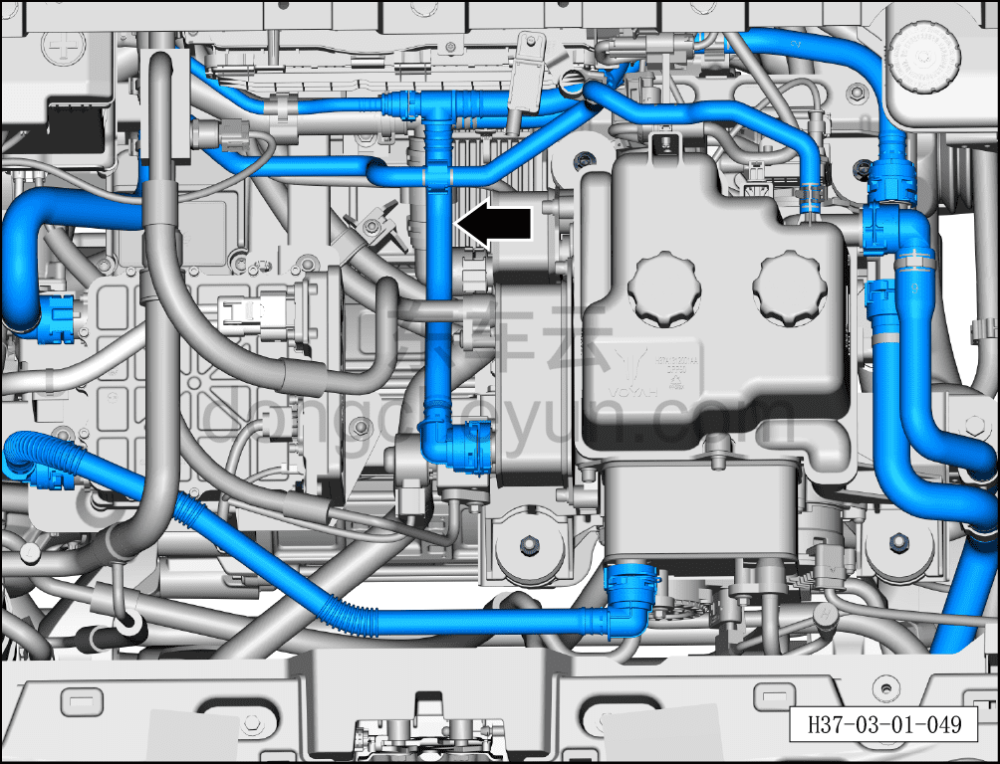

# Проверка шлангов и соединений системы охлаждения

> Техническое обслуживание › Техническое обслуживание › Работы в нижней части автомобиля  
> Оригинал: `检查冷却系统胶管和接头` · [dongcheyun 56746](https://dongcheyun.com/p/56746), страница `03989bb68e764fbf9b3db2649c596ccc` · [оглавление](../README.md)

1. Выключить все электроприборы, обесточить автомобиль.

2. Отсоединить минусовую клемму аккумуляторной батареи.

3. Поднять автомобиль на подъёмнике.

4. Снять передний нижний защитный щиток. См. [8.6.4.3 Снятие и установка переднего нижнего защитного щитка](../08-внутренняя-и-внешняя-отделка/193-снятие-и-установка-переднего-нижнего-защитного-щитка.md)

5. Проверить шланги и соединения системы охлаждения.

a. Проверить соединения шлангов на старение, повреждения или подтёки; при обнаружении своевременно заменить.

b. Проверить, что уровень охлаждающей жидкости находится в пределах между отметками MAX и MIN.

c. Если уровень охлаждающей жидкости слишком низкий, необходимо долить охлаждающую жидкость.
