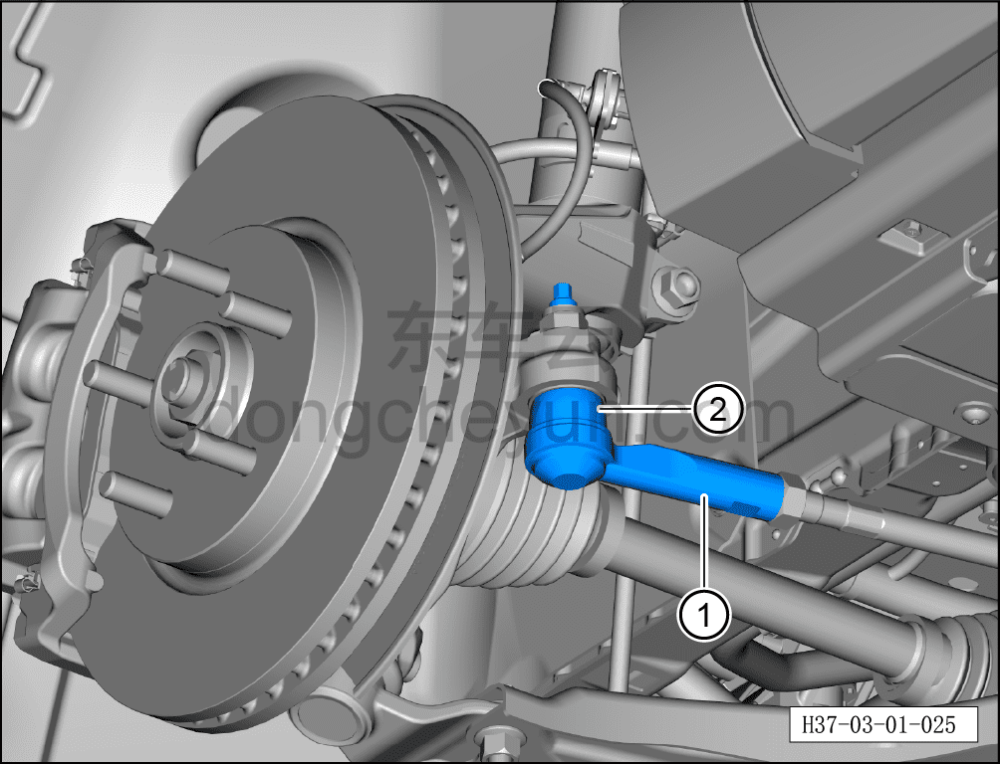
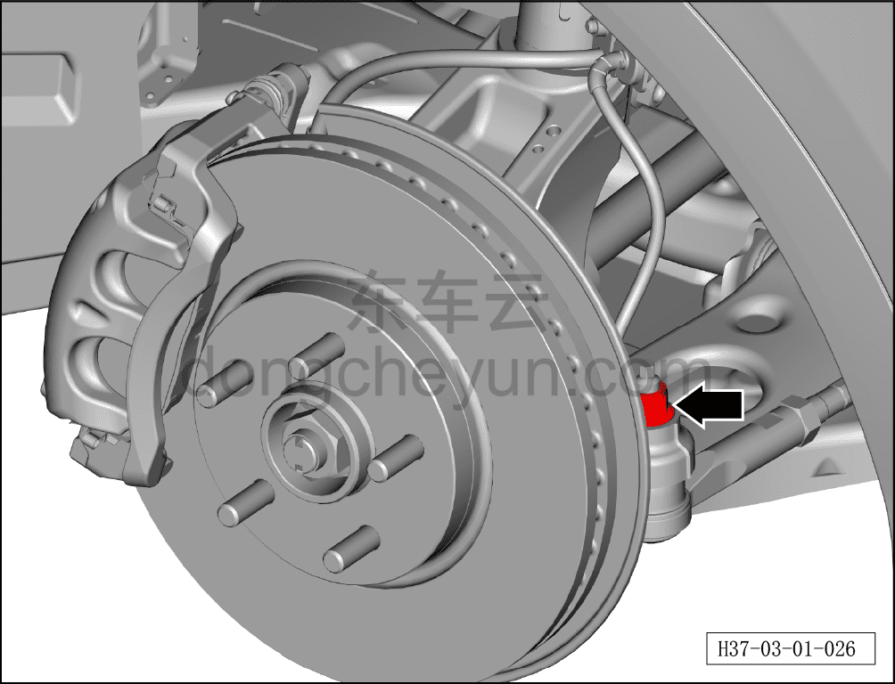
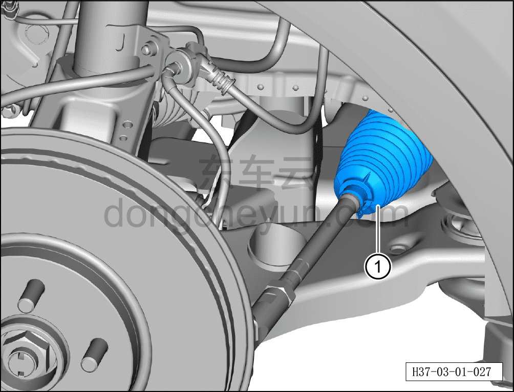

# Проверка шарового шарнира рулевой тяги, пыльника

> Техническое обслуживание › Техническое обслуживание › Работы в нижней части автомобиля  
> Оригинал: `检查转向拉杆球头、防尘套` · [dongcheyun 56746](https://dongcheyun.com/p/56746), страница `5623ed9878544c12b838c4bde3f73e00` · [оглавление](../README.md)

1. Проверить шаровой шарнир рулевой поперечной тяги, крепёжное устройство и пыльник.

a. Поднять автомобиль на подходящую высоту, покачать рукой поперечную тягу ①, проверить наличие люфта.

b. Проверить пыльник шарового шарнира рулевой поперечной тяги ② на отсутствие повреждений; при повреждении заменить шаровой шарнир рулевой поперечной тяги. См. [6.1.6.1 Снятие и установка рулевого механизма с поперечной тягой в сборе](../06-система-шасси/006-снятие-и-установка-рулевого-механизма.md)

c. Проверить надёжность крепёжной гайки шарового шарнира поперечной тяги.

Момент затяжки гайки: 110±10 Н·м.

d. Проверить резиновый пыльник рулевого механизма ① на отсутствие повреждений и старения; при обнаружении заменить резиновый пыльник рулевого механизма. См. [6.1.6.3 Снятие и установка пыльника рулевого вала](../06-система-шасси/008-снятие-и-установка-пыльника-вала-рулевого-управления.md)
