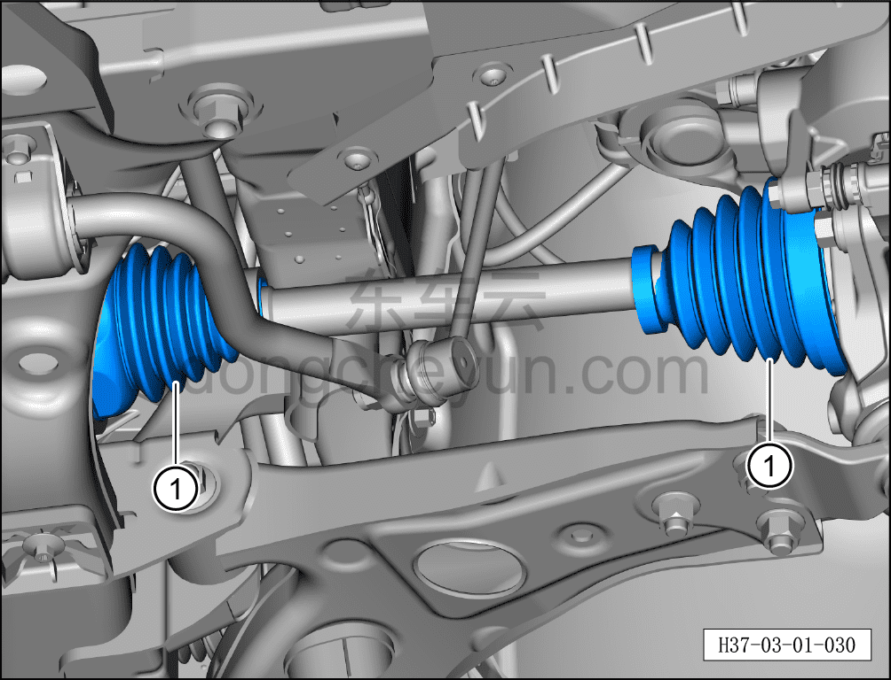

# Проверка приводного вала и пыльника

> Техническое обслуживание › Техническое обслуживание › Работы в нижней части автомобиля  
> Оригинал: `检查驱动轴及防尘套` · [dongcheyun 56746](https://dongcheyun.com/p/56746), страница `d093bb94577d4e57b9325e92b49ddcac` · [оглавление](../README.md)

1. Визуально проверить приводной вал и пыльник.

a. Проверить приводной вал и пыльник ① на отсутствие повреждений, старения и трещин.

b. При обнаружении повреждений заменить приводной вал в сборе.
