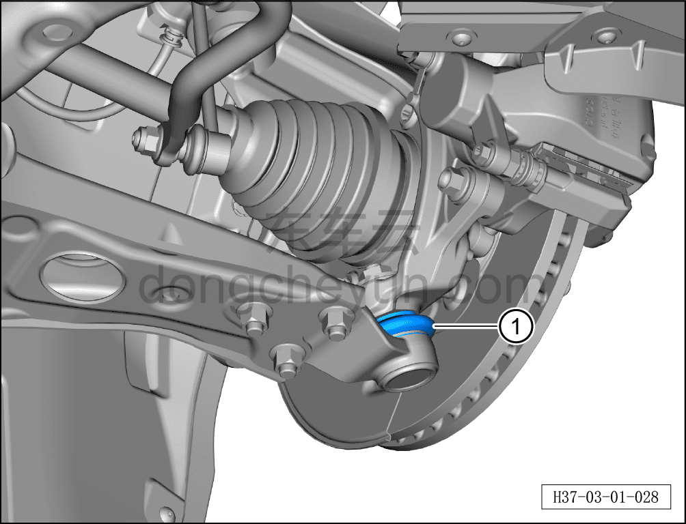
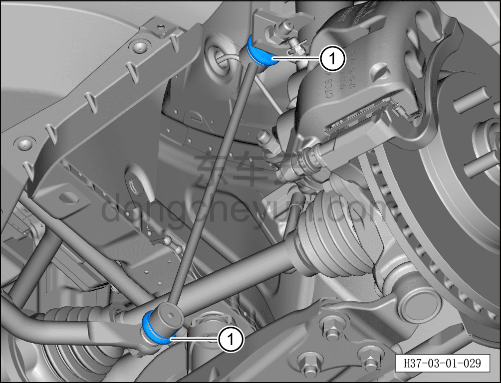

# Проверка шарового шарнира нижнего рычага подвески и шарового шарнира тяги стабилизатора

> Техническое обслуживание › Техническое обслуживание › Работы в нижней части автомобиля  
> Оригинал: `检查下摆臂球头和稳定杆拉杆球头` · [dongcheyun 56746](https://dongcheyun.com/p/56746), страница `ff2eea4e46bf4152977f4a96bf23e4aa` · [оглавление](../README.md)

1. Шаровой шарнир нижнего рычага подвески.

a. Проверить пыльник шарового шарнира нижнего рычага подвески ① на отсутствие повреждений, старения и трещин.

b. Проверить шаровой шарнир нижнего рычага подвески на отсутствие ослабления.

c. При обнаружении повреждений заменить шаровой шарнир нижнего рычага подвески в сборе. См. [6.2.7.1 Снятие и установка нижнего рычага передней подвески с шаровым пальцем в сборе](../06-система-шасси/019-снятие-и-установка-нижнего-рычага-передней-подвески-с.md)

2. Шаровой шарнир тяги стабилизатора поперечной устойчивости.

a. Проверить шаровой шарнир стабилизатора поперечной устойчивости ① на отсутствие повреждений; при повреждении заменить тягу стабилизатора поперечной устойчивости. См. [6.2.8.1 Снятие и установка левого переднего наконечника стабилизатора в сборе](../06-система-шасси/020-снятие-и-установка-стойки-левого-переднего.md)
