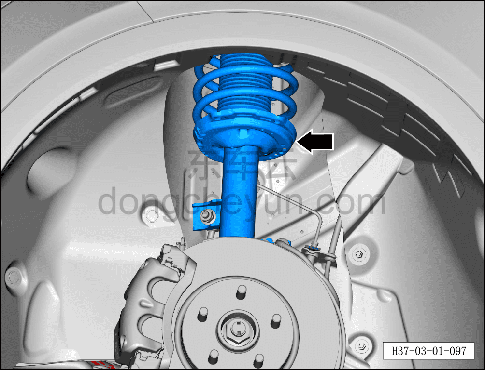

# Проверка амортизаторов

> Техническое обслуживание › Техническое обслуживание › Работы в нижней части автомобиля  
> Оригинал: `检查减振器` · [dongcheyun 56746](https://dongcheyun.com/p/56746), страница `c10f63b080904e41a67742d238b5326c` · [оглавление](../README.md)

1. Поднять автомобиль на подъёмнике.

2. Проверить передние/задние амортизаторы.

-Проверить амортизаторы на наличие подтёков масла или других повреждений.
