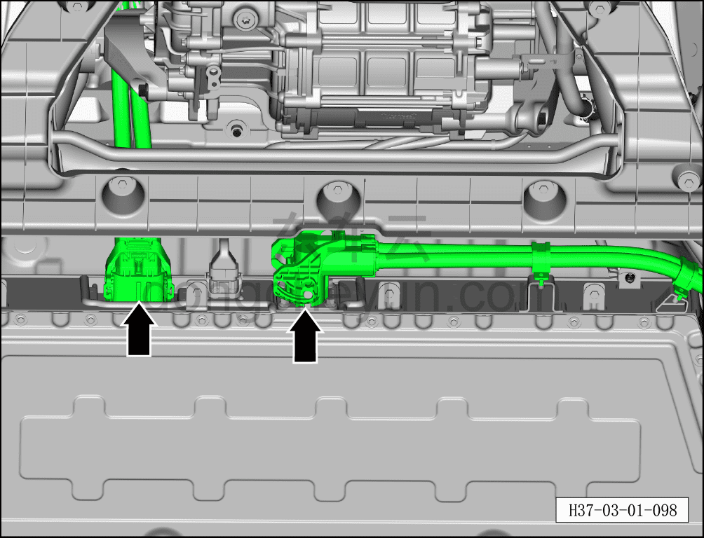

# Проверка высоковольтного жгута проводов и высоковольтных разъёмов

> Техническое обслуживание › Техническое обслуживание › Работы в нижней части автомобиля  
> Оригинал: `检查高压线束及高压连接器` · [dongcheyun 56746](https://dongcheyun.com/p/56746), страница `7541058011bf4bb7b11bac33e85536d3` · [оглавление](../README.md)

1. Выключить все электроприборы, обесточить автомобиль.

2. Поднять автомобиль на подъёмнике.

3. Снять передний нижний защитный щиток. См. [8.6.4.3 Снятие и установка переднего нижнего защитного щитка](../08-внутренняя-и-внешняя-отделка/193-снятие-и-установка-переднего-нижнего-защитного-щитка.md)

4. Снять задний нижний защитный щиток. См. [8.6.4.4 Снятие и установка заднего нижнего защитного щитка](../08-внутренняя-и-внешняя-отделка/194-снятие-и-установка-заднего-нижнего-защитного-щитка.md)

5. Проверить высоковольтный жгут проводов и высоковольтные разъёмы.

-Проверить высоковольтный жгут проводов на отсутствие повреждений, надёжность его крепления.

-Проверить высоковольтные разъёмы на отсутствие ослабления и плохого контакта.

**Внимание:**

**-При проведении проверки обязательно надевать защитную каску, изолирующую обувь, защитные очки и другие защитные средства.**
