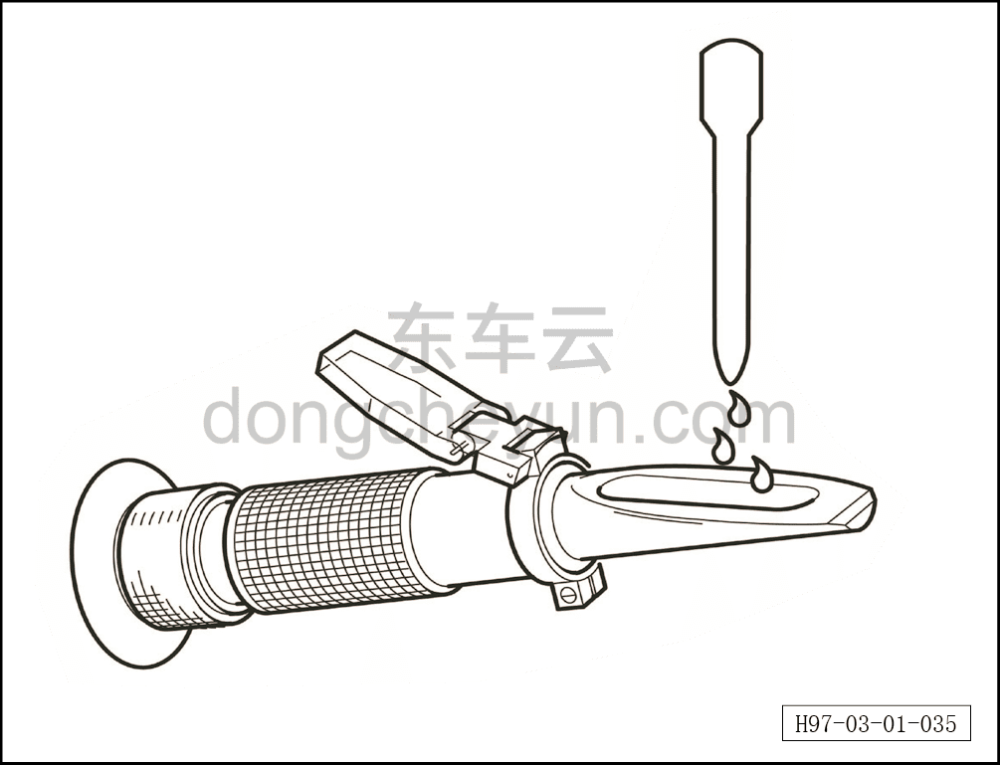
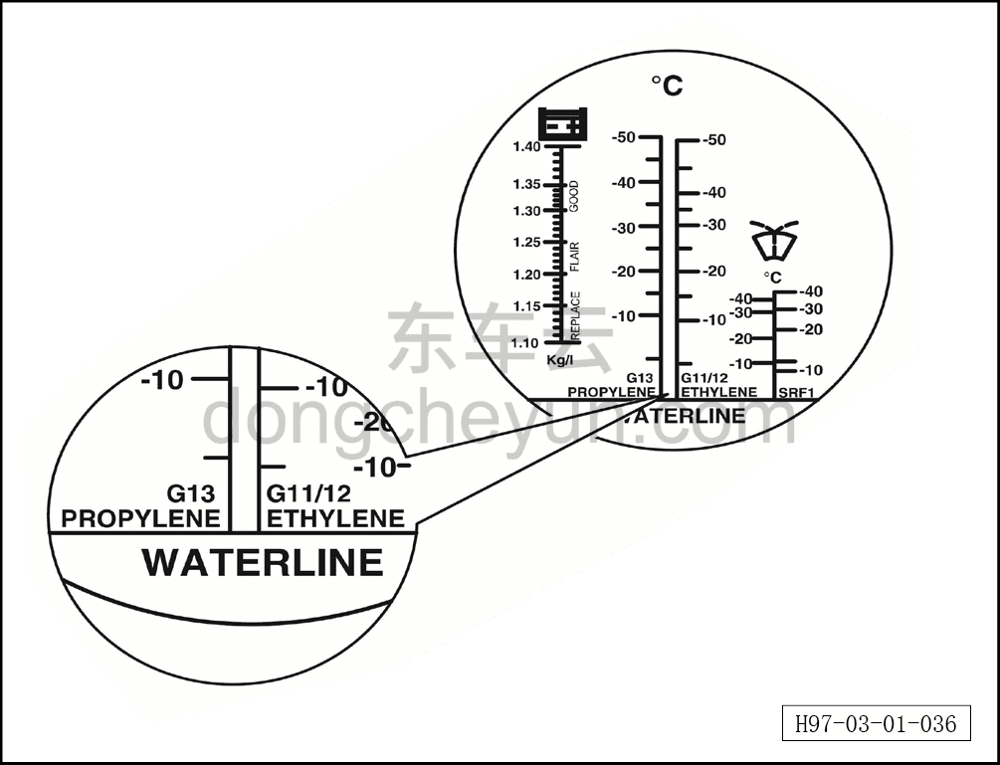

# Проверка охлаждающей жидкости тягового электродвигателя и тяговой батареи

> Техническое обслуживание › Техническое обслуживание › Работы под капотом  
> Оригинал: `检查驱动电机和动力电池冷却液` · [dongcheyun 56746](https://dongcheyun.com/p/56746), страница `acf7223a9b344ae0b784721914b6ddbe` · [оглавление](../README.md)

1. Открыть капот, снять декоративную панель моторного отсека. См. [8.6.6.10 Снятие и установка декоративной панели моторного отсека](../08-внутренняя-и-внешняя-отделка/223-снятие-и-установка-декоративной-накладки-моторного.md)

2. Проверить уровень охлаждающей жидкости.

a. Проверить уровень охлаждающей жидкости в расширительном бачке, когда тяговый электродвигатель и тяговая батарея находятся в обычном состоянии.

b. Уровень охлаждающей жидкости должен находиться между отметками MAX (максимум) и MIN (минимум).

c. Если уровень охлаждающей жидкости слишком низкий, необходимо долить охлаждающую жидкость.

**Примечание:**

**-Общий объём охлаждающей жидкости: 14,5±0,5 л (версия с одним приводом, 2WD).**

**-Общий объём охлаждающей жидкости: 15,5±0,5 л (полноприводная версия, AWD).**

3. Проверить температуру замерзания охлаждающей жидкости.

a. С помощью пипетки нанести каплю охлаждающей жидкости на стекло рефрактометра, определить значение температуры замерзания охлаждающей жидкости.

**Примечание:**

**-Считывайте измеренное значение по границе света и тени; для лучшего различения границы света и тени можно нанести пипеткой каплю воды на стекло рефрактометра — по «водяной линии» граница света и тени будет отчётливо видна.**

b. Считать значение температуры замерзания охлаждающей жидкости.

**Примечание:**

**-Необходимо обеспечить, чтобы значение температуры замерзания охлаждающей жидкости было не выше -35°C (значение может изменяться в зависимости от региона и климата).**

**-Если температура замерзания охлаждающей жидкости не соответствует нормативному значению, необходимо заменить охлаждающую жидкость.**

**Внимание:**

**-Когда система охлаждения находится в горячем состоянии, не открывайте крышку заливной горловины расширительного бачка, иначе горячий пар или кипящая охлаждающая жидкость могут брызнуть из бачка и травмировать человека.**

**-Охлаждающая жидкость токсична; храните ёмкость герметично закрытой и в месте, недоступном для детей; при случайном проглатывании немедленно обратитесь к врачу.**

**-Не допускайте попадания охлаждающей жидкости на кожу или в глаза. При попадании немедленно промойте большим количеством чистой воды.**

**-Никогда не добавляйте в охлаждающую жидкость антикоррозионные присадки — это может быть несовместимо с охлаждающей жидкостью или моторным отсеком. Не смешивайте с другими охлаждающими жидкостями; температура замерзания выбранной для автомобиля охлаждающей жидкости должна быть ниже минимальной температуры данной местности на 10–15°C.**

**-Охлаждающая жидкость обладает коррозионным действием и может повредить лакокрасочное покрытие. Если при заправке жидкость пролилась, немедленно удалите её впитывающей тканью и промойте автомобильным моющим средством с водой.**
