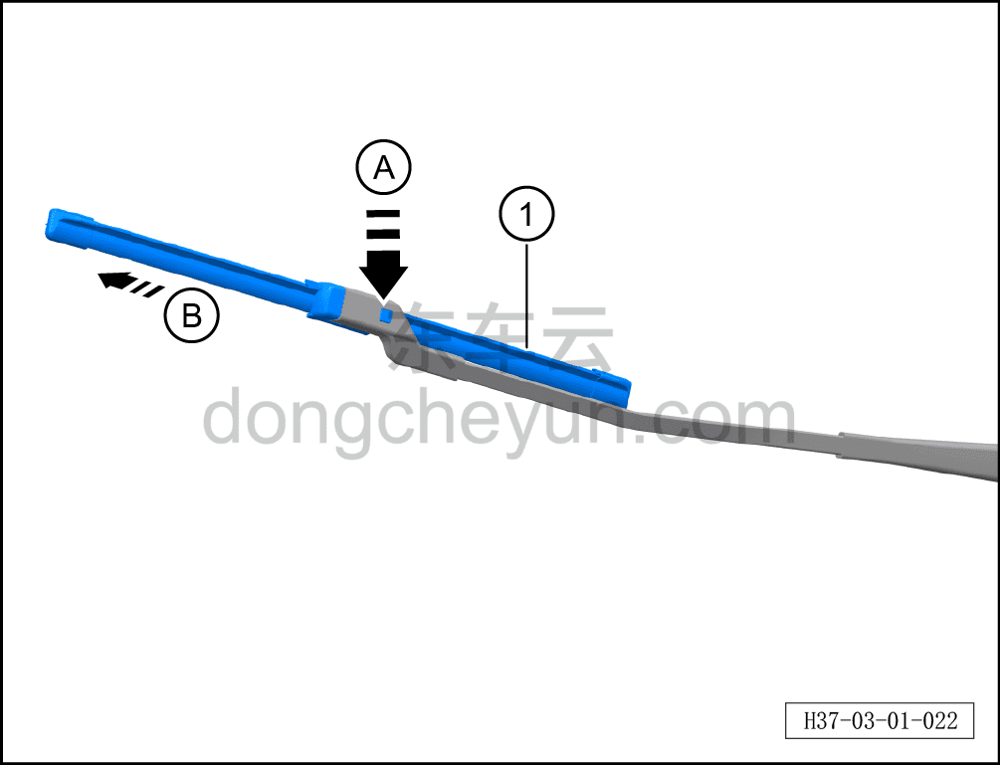

# Проверка щёток стеклоочистителя

> Техническое обслуживание › Техническое обслуживание › Работы под капотом  
> Оригинал: `检查雨刮片` · [dongcheyun 56746](https://dongcheyun.com/p/56746), страница `9aa4330434fd4e4d8f48aeb4556e1d7d` · [оглавление](../README.md)

**Порядок снятия**

1. Замена щётки стеклоочистителя.

a. Установить рычаг стеклоочистителя в сервисное положение.

b. Нажать на фиксирующую защёлку щётки стеклоочистителя A, извлечь щётку стеклоочистителя ① в направлении B.

**Порядок установки**

Установка выполняется в обратном порядке.

**Внимание:**

**-После завершения установки подать питание на автомобиль, включить режим стеклоочистителя с омывателем, проверить нормальную работу стеклоочистителя, убедиться в правильности установки, выключить выключатель стеклоочистителя.**
