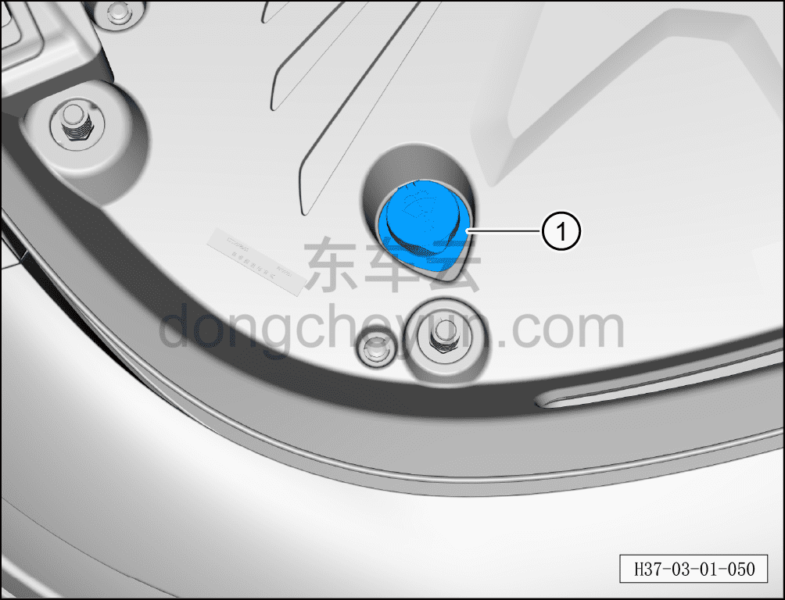

# Проверка жидкости омывателя лобового стекла

> Техническое обслуживание › Техническое обслуживание › Работы под капотом  
> Оригинал: `检查风窗洗涤液` · [dongcheyun 56746](https://dongcheyun.com/p/56746), страница `824ecb3f7d3a4205be912277083b0bcf` · [оглавление](../README.md)

1. Проверить уровень омывающей жидкости и долить.

a. Омывающая жидкость является расходным материалом; проверяйте её регулярно (каждые две недели или раз в месяц). При недостатке долейте омывающую жидкость.

b. Открыть крышку заливной горловины ①, долить омывающую жидкость до видимой зоны под горловиной. Не допускайте перелива.

– Общий объём заправки омывающей жидкости: 2,8 л.

**Внимание:**

**-Омывающая жидкость предотвращает замерзание форсунок, резервуара и соединительных шлангов.**

**-Выбирайте омывающую жидкость с морозостойкостью, соответствующей фактической температуре в данной местности.**

**-В тёплое время года также необходимо добавлять омывающую жидкость — её высокая моющая способность позволяет удалять с лобового стекла остатки воска и масляных загрязнений.**

**-Необходимо обеспечить, чтобы система омывателя лобового стекла не замерзала при температуре до примерно -25°C (в отдельных регионах с суровым климатом — до примерно -35°C).**
