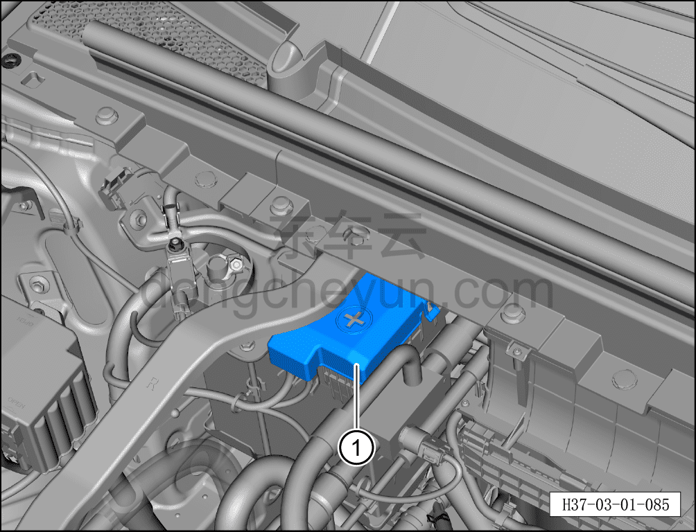
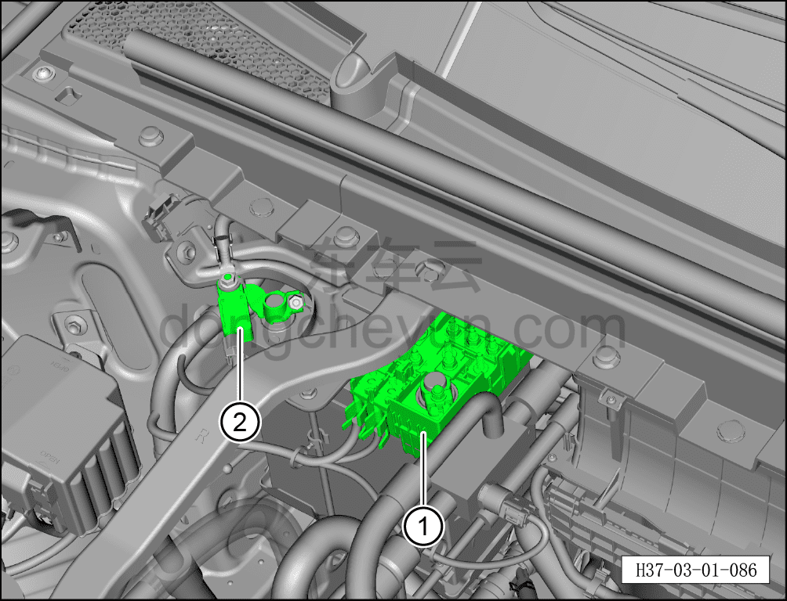
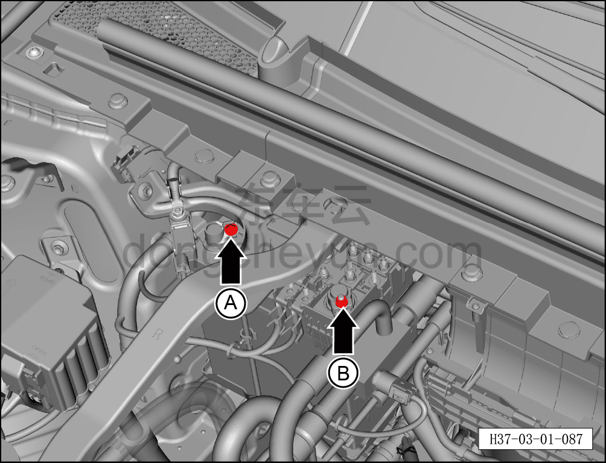
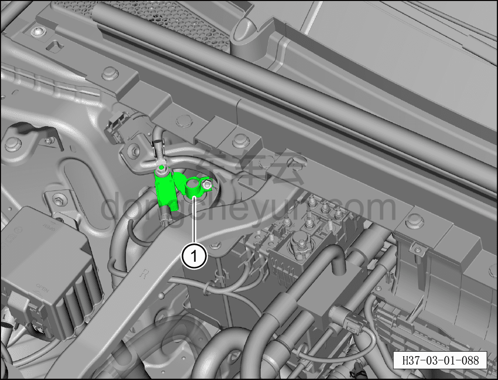
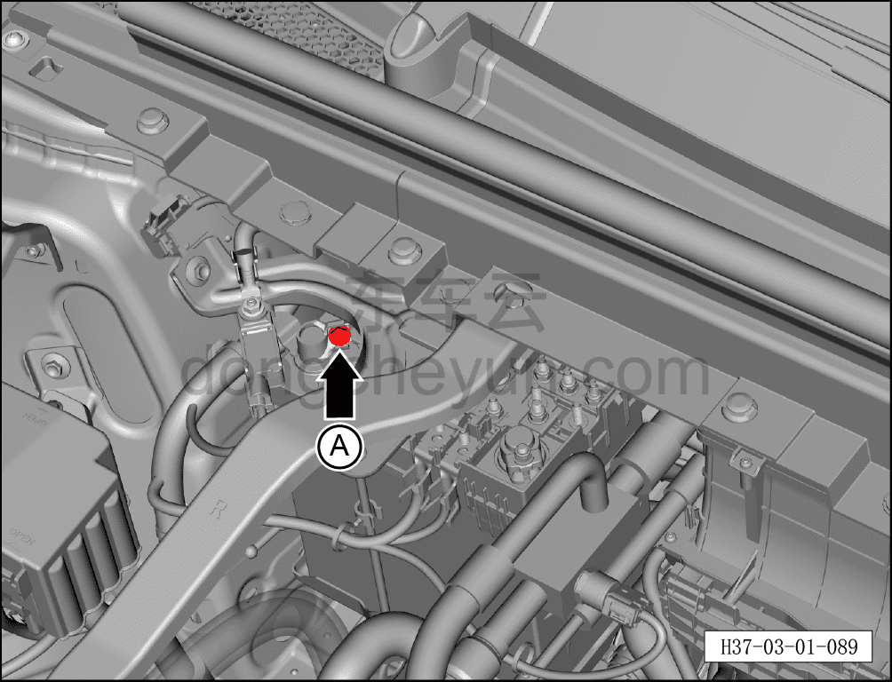

# Проверка и обслуживание аккумуляторной батареи 12 В

> Техническое обслуживание › Техническое обслуживание › Работы под капотом  
> Оригинал: `检查维护蓄电池` · [dongcheyun 56746](https://dongcheyun.com/p/56746), страница `769330addc5943c7acbda53c2f197702` · [оглавление](../README.md)

**Порядок проверки**

**Примечание:**

**-Перед проверкой выключить все электроприборы, обесточить автомобиль.**

1. Выполнить работу по следующим шагам.

a. Открыть защитную крышку плюсовой клеммы аккумуляторной батареи ①.

b. Покачать влево-вправо наконечник плюсовой клеммы ① и наконечник минусовой клеммы ② аккумуляторной батареи, проверить надёжность их крепления.

2. Если плюсовая клемма аккумуляторной батареи закреплена ненадёжно.

a. Отвернуть крепёжную гайку A минусовой клеммы аккумуляторной батареи, отсоединить клемму.

b. Повторно установить плюсовую клемму аккумуляторной батареи, затянуть крепёжную гайку B.

c. Установить минусовую клемму аккумуляторной батареи, затянуть крепёжную гайку.

Момент затяжки гайки: 15±2 Н·м.

3. Если минусовая клемма аккумуляторной батареи закреплена ненадёжно.

a. Повторно установить минусовую клемму аккумуляторной батареи ①, затянуть крепёжную гайку.

Момент затяжки гайки: 15±2 Н·м.

4. При длительной стоянке автомобиля отсоединить минусовую клемму аккумуляторной батареи.

Порядок отсоединения минусовой клеммы аккумуляторной батареи следующий:

a. Отвернуть крепёжную гайку, отсоединить минусовую клемму аккумуляторной батареи и отвести её в сторону, чтобы предотвратить повторный контакт с минусовой клеммой батареи.

Момент затяжки гайки: 15±2 Н·м.

5. Провести визуальный осмотр аккумуляторной батареи.

-Перед проведением полной проверки обязательно визуально проверить внешнее состояние аккумуляторной батареи, состояние подключения и надёжность её крепления.

**Внимание:**

**-Если аккумуляторная батарея закреплена неправильно, это может привести к её повреждению. Повреждения от вибрации сокращают срок службы батареи, создают риск взрыва и могут повредить её корпус. Проверьте надёжность установки батареи и при необходимости затяните крепёжные болты с нормативным моментом затяжки.**

**-Проверьте, не повреждён ли корпус батареи: повреждение корпуса приводит к вытеканию кислоты, которая может серьёзно повредить автомобиль; детали автомобиля, соприкоснувшиеся с электролитом, необходимо немедленно обработать нейтрализатором электролита или мыльным раствором.**

**-Проверьте, не повреждены ли клеммы батареи: повреждение клемм не гарантирует надёжного контакта. При подключении клемм батареи руководствуйтесь соответствующим руководством по ремонту автомобиля. Если клеммы батареи неправильно подключены и не затянуты, это может привести к возгоранию проводки и, как следствие, к серьёзным сбоям в работе электрооборудования, что не позволит обеспечить безопасную эксплуатацию автомобиля.**

6. Измерить статическое напряжение аккумуляторной батареи.

**Примечание:**

**-В рамках установленных работ по ремонту и обслуживанию допускается измерение статического напряжения аккумуляторной батареи только у автомобилей, находящихся на стоянке или на складе, для оценки состояния батареи. По измерению статического напряжения можно определить, требуется ли подзарядка аккумуляторной батареи автомобиля, находящегося на стоянке или на складе.**

**-В течение как минимум двух дней батарея не должна ни заряжаться, ни разряжаться.**

**-Используйте «прибор для проверки аккумуляторной батареи» для проверки напряжения и ёмкости батареи.**

| Результат измерения | Действие |
|---|---|
| Батарея исправна | Продолжить использование аккумуляторной батареи |
| Исправна — требуется зарядка | После полной зарядки аккумуляторной батареи продолжить её использование |
| После зарядки повторить проверку | После полной зарядки аккумуляторной батареи провести повторную проверку |
| Заменить батарею | Возможно, плохое соединение кабелей аккумуляторной батареи; после устранения неисправности повторно проверить аккумуляторную батарею |
| Батарея с повреждённой ячейкой — требуется замена | Необходимо немедленно заменить аккумуляторную батарею |
