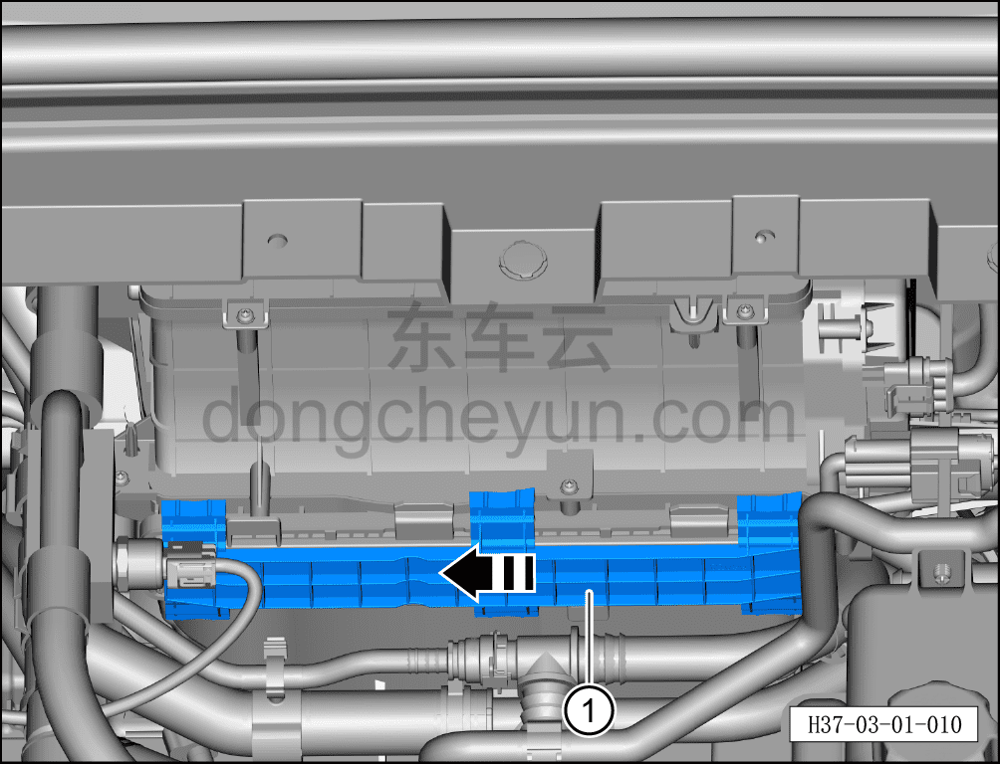
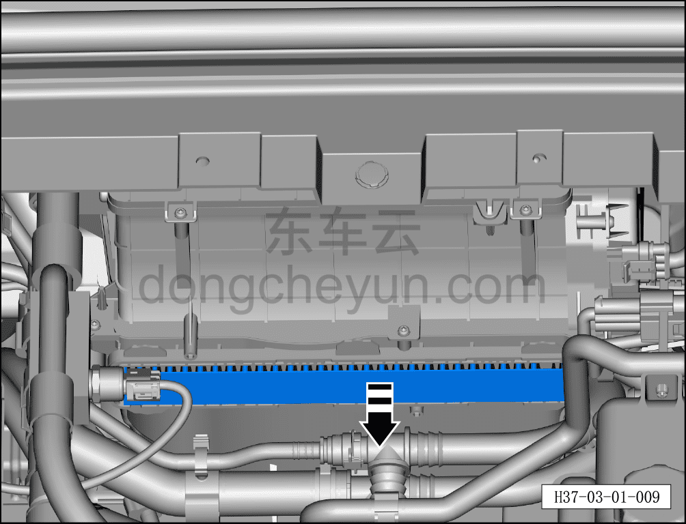

# Замена фильтрующего элемента фильтра кондиционера

> Техническое обслуживание › Техническое обслуживание › Работы в салоне автомобиля  
> Оригинал: `更换空调滤清器滤芯` · [dongcheyun 56746](https://dongcheyun.com/p/56746), страница `6d184a64c63944daa5c098931760a8f9` · [оглавление](../README.md)

**Порядок снятия**

1. Замена фильтра кондиционера

a. Открыть капот, снять декоративную панель моторного отсека. См. [8.6.6.10 Снятие и установка декоративной панели моторного отсека](../08-внутренняя-и-внешняя-отделка/223-снятие-и-установка-декоративной-накладки-моторного.md)

b. Сдвинуть фиксирующую защёлку крышки фильтра кондиционера в направлении стрелки, снять крышку фильтра кондиционера ①.

c. Извлечь фильтр кондиционера.

**Порядок установки**

Установка выполняется в обратном порядке.

**Примечание:**

**-При установке фильтра кондиционера имеется правильная и обратная сторона — обратите внимание на направление установки.**
