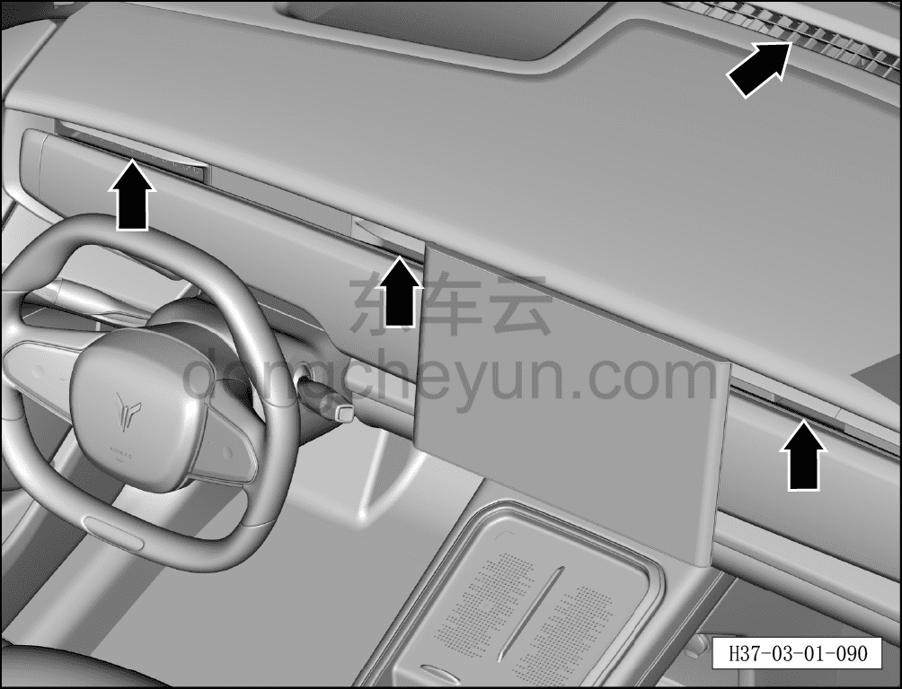

# Проверка эффективности охлаждения и отопления кондиционера

> Техническое обслуживание › Техническое обслуживание › Работы в салоне автомобиля  
> Оригинал: `检查空调制冷、制热效果` · [dongcheyun 56746](https://dongcheyun.com/p/56746), страница `2c1d3dc4380b4a32b9d473e4646f9330` · [оглавление](../README.md)

**Порядок проверки**

1. Выполнить проверку по следующим шагам.

a. Подать питание на автомобиль, воспользоваться панелью управления кондиционером на мультимедийном дисплее.

b. Установить минимальную температуру кондиционера, максимальный расход воздуха, проверить температуру на выходе воздуховодов.

c. Установить максимальную температуру кондиционера, максимальный расход воздуха, проверить температуру на выходе воздуховодов.
