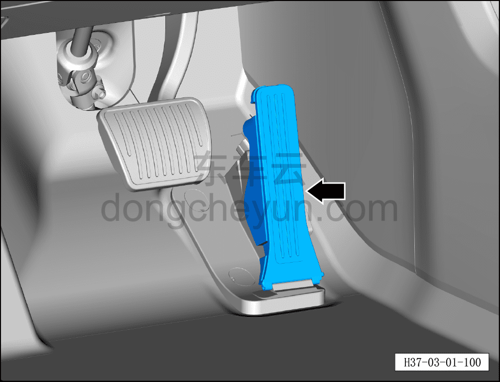
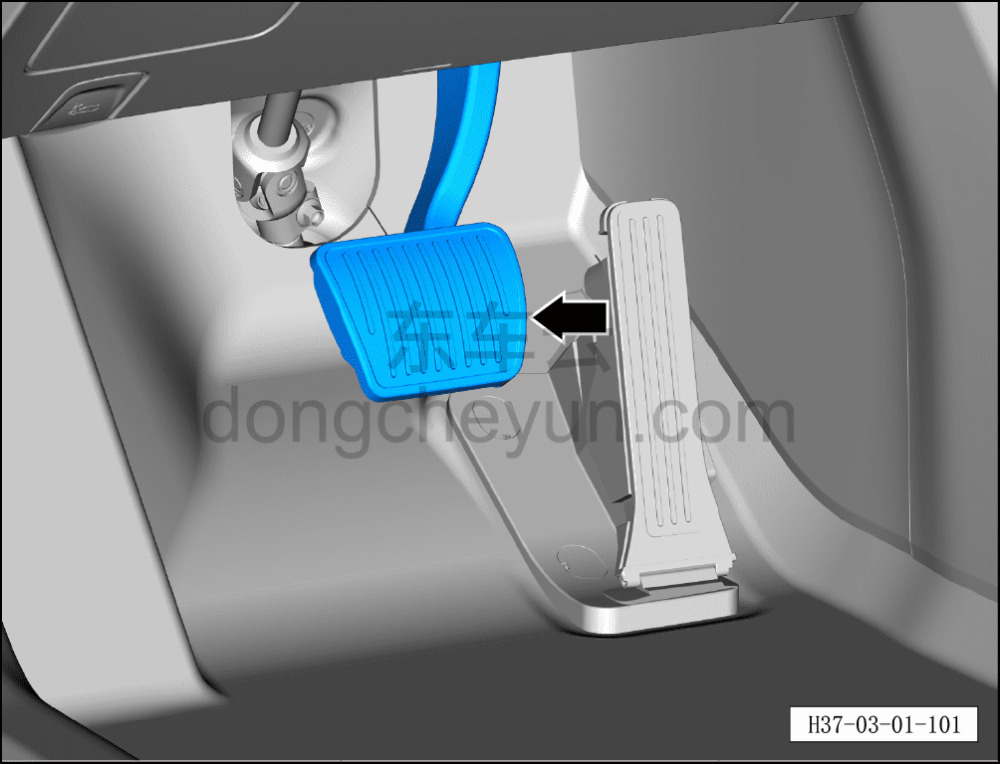

# Проверка педалей

> Техническое обслуживание › Техническое обслуживание › Работы в салоне автомобиля  
> Оригинал: `检查踏板` · [dongcheyun 56746](https://dongcheyun.com/p/56746), страница `2d989cc2a007462393400b7eef7c5895` · [оглавление](../README.md)

1. Проверить электронную педаль акселератора.

a. Проверить свободный ход, полный ход и возврат электронной педали акселератора на нормальную работу.

2. Проверить педаль тормоза.

a. Проверить свободный ход, ход и возврат педали тормоза на нормальную работу.
