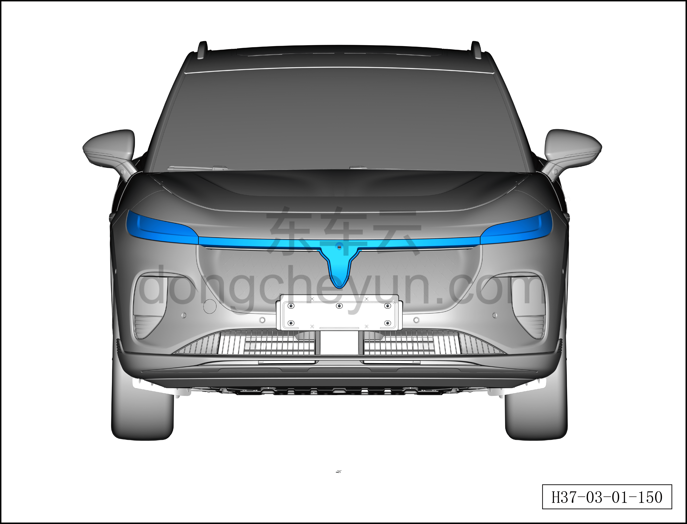
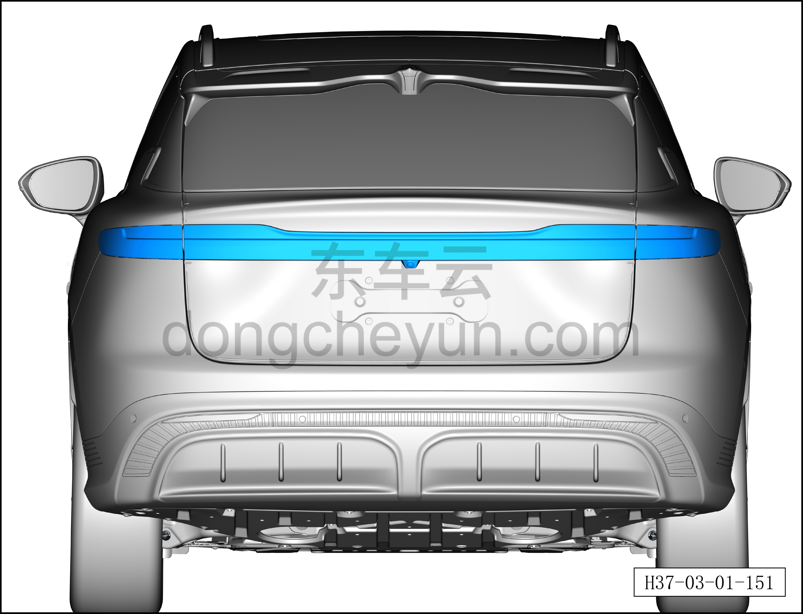
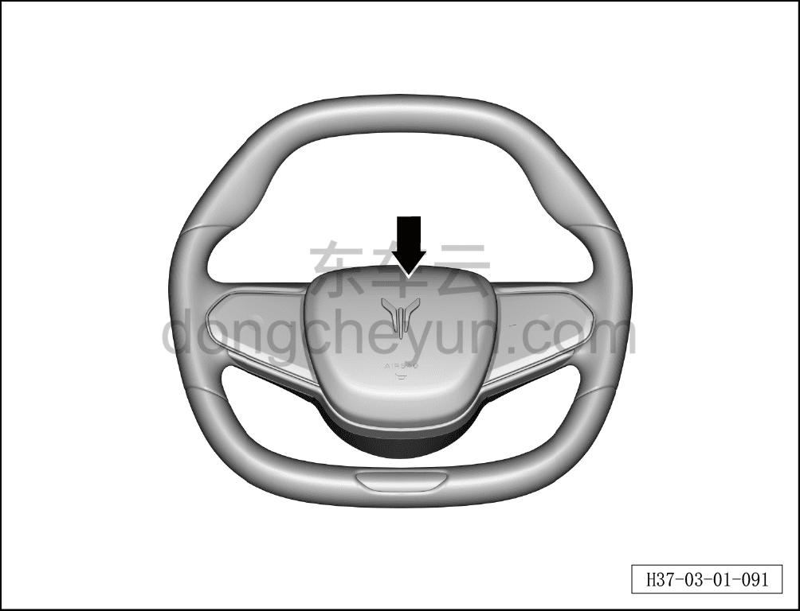

# Проверка освещения автомобиля и звукового сигнала

> Техническое обслуживание › Техническое обслуживание › Работы в салоне автомобиля  
> Оригинал: `检查车辆灯光和喇叭` · [dongcheyun 56746](https://dongcheyun.com/p/56746), страница `b990421f088b4290ab53bba5d8a4b984` · [оглавление](../README.md)

1. Проверить нормальную работу переднего освещения автомобиля.

a. Проверить нормальную работу левого и правого указателей поворота, левой и правой фар, левого и правого переднего габаритного огня и подсвечиваемой передней эмблемы.

2. Проверить нормальную работу заднего освещения автомобиля.

a. Проверить нормальную работу дополнительного стоп-сигнала, неподвижной части левого и правого заднего комбинированного фонаря, подвижной части левого и правого заднего комбинированного фонаря и среднего заднего противотуманного фонаря.

3. Проверить нормальную работу звукового сигнала.

a. Нажать выключатель звукового сигнала, проверить его нормальную работу.
