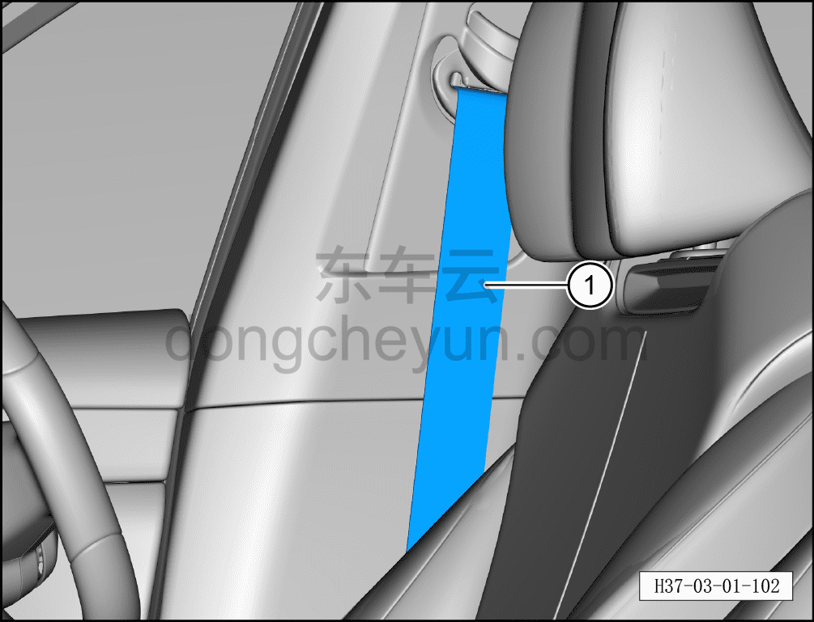
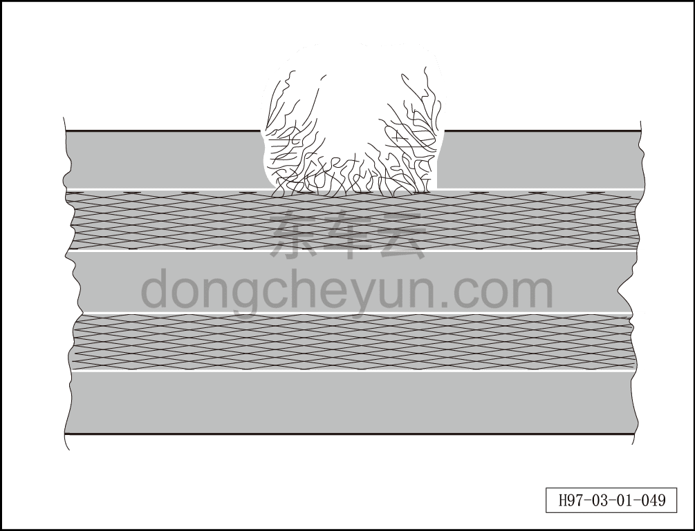
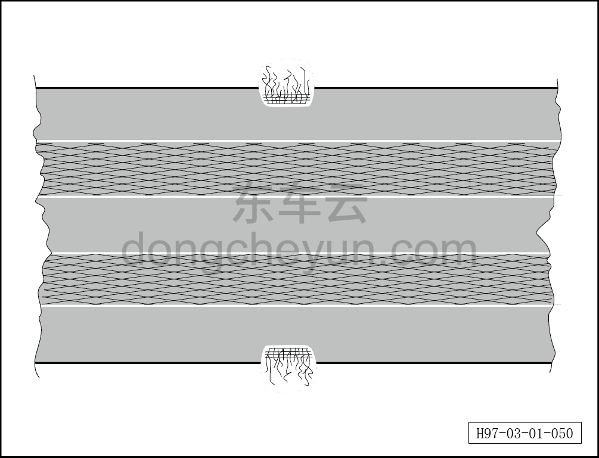
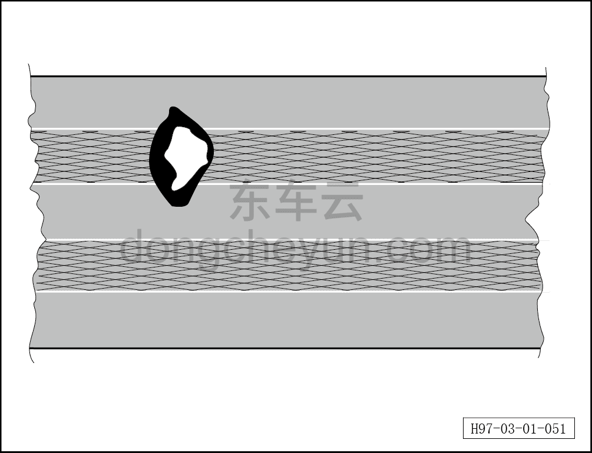
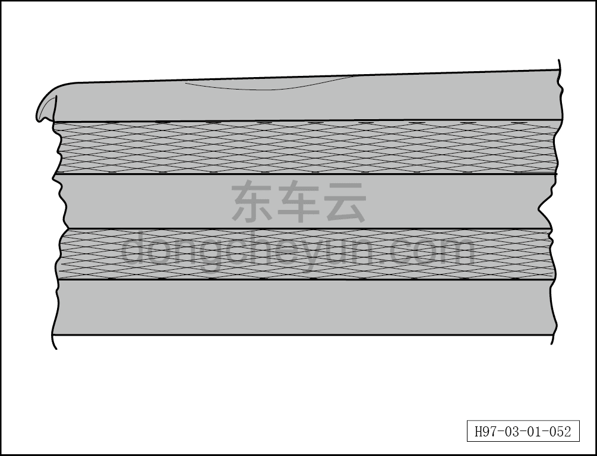
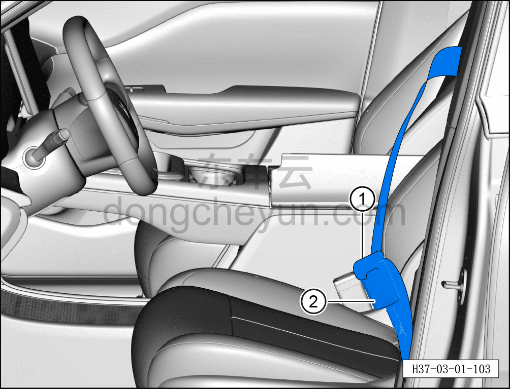
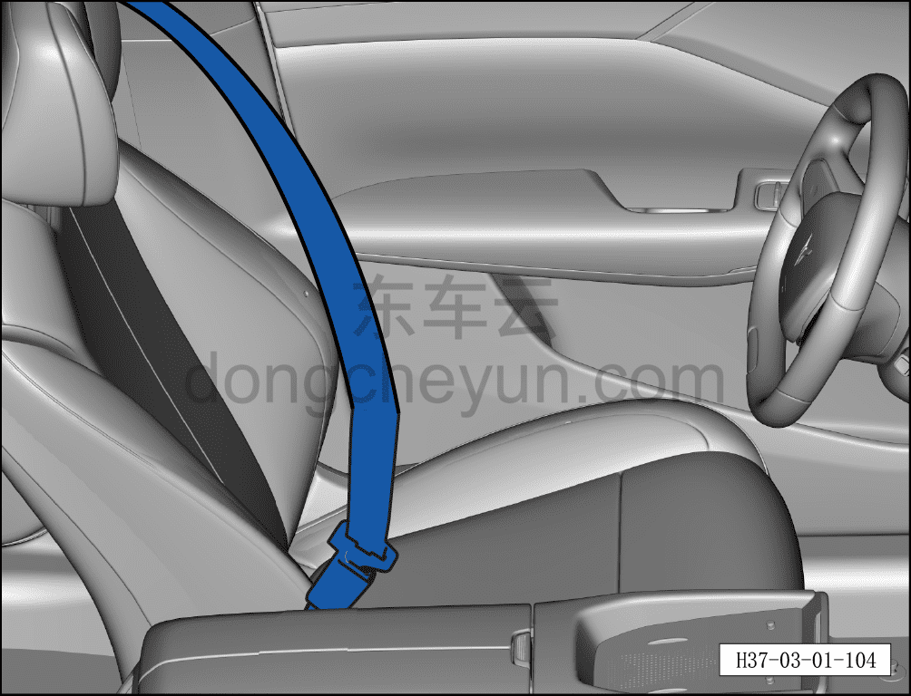

# Проверка и обслуживание ремней безопасности

> Техническое обслуживание › Техническое обслуживание › Работы в салоне автомобиля  
> Оригинал: `检查维护安全带` · [dongcheyun 56746](https://dongcheyun.com/p/56746), страница `cdb69156c5aa47a4adc2d3124be63871` · [оглавление](../README.md)

**Порядок проверки**

1. Проверить ремень безопасности.

a. Полностью вытянуть ремень безопасности ① из устройства автоматической ретракции ремня.

b. Проверить ремень безопасности на загрязнение, при необходимости очистить нейтральным мыльным раствором.

**Внимание:**

**-При обнаружении повреждений необходимо полностью заменить ремень безопасности и замок ремня безопасности в сборе.**

c. При обрыве, разрыве или потёртости ремня безопасности необходимо заменить ремень безопасности.

d. Если петля ткани на кромке ремня безопасности порвана, ремень безопасности необходимо заменить.

e. Если на ремне безопасности есть следы прожога сигаретой и т.п., ремень безопасности необходимо заменить.

f. Если одна сторона кромки ремня безопасности деформирована или кромка ремня безопасности имеет волнообразную форму, ремень безопасности необходимо заменить.

2. Проверьте устройство автоматической перемотки (функцию блокировки).

- Резко и с усилием вытяните ремень безопасности из устройства автоматической перемотки; если функция блокировки не срабатывает, замените ремень безопасности и узел замка ремня безопасности в комплекте.

3. Проверка работы узла замка ремня безопасности

a. Запирающее устройство: проверка.

Вставьте язычок замка ① в узел замка ремня безопасности ② до щелчка. Повторите операцию 5 раз, с усилием потянув ремень безопасности, и проверьте надёжность срабатывания запирающего механизма.

**Внимание:**

**-Если в ходе 5 и более проверок язычок замка хотя бы один раз не зафиксировался в узле замка ремня безопасности, необходимо заменить ремень безопасности и узел замка ремня безопасности в комплекте.**

b. Разблокирующее устройство: проверка.

-Нажмите кнопку на узле замка ремня безопасности, чтобы освободить ремень безопасности.

-При слабом натяжении ремня безопасности язычок замка должен автоматически выталкиваться из узла замка ремня безопасности.

**Примечание:**

**-Если установлено, что эти детали повреждены, необходимо заменить ремень безопасности, узел замка ремня безопасности и болты точек крепления в комплекте.**

**-Для повреждений, не вызванных дорожно-транспортным происшествием, например износа, необходимо заменить только соответствующую повреждённую деталь.**

**Внимание:**

**-Категорически запрещается наносить смазку на кнопку узла замка ремня безопасности для устранения шума или тугого хода при работе с ремнём безопасности.**

**-В целях безопасности дорожные испытания необходимо проводить на безлюдном участке дороги, чтобы не создавать угрозу другим транспортным средствам или пешеходам.**
